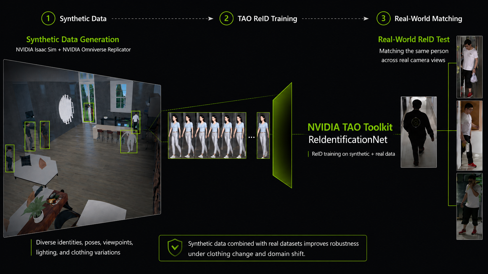
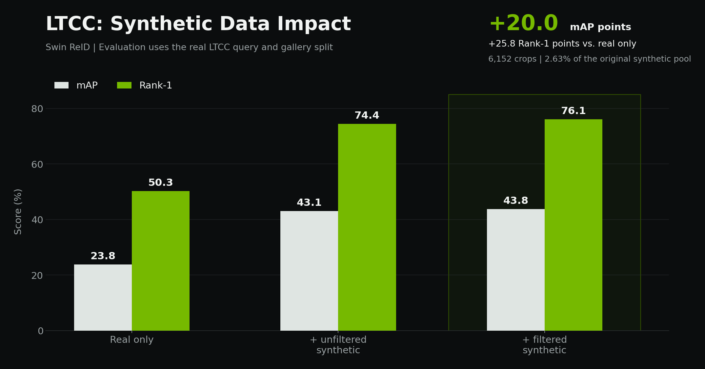

# Synthetic Data Enhanced Multi-Camera Person Re-Identification

[](https://developer.nvidia.com/tao-toolkit)
[](experiments/reid/generalized_reid_swin/configs/generalized_swin.yaml)
[](datasets/final_syntetic_market1501/README.md)
[](https://github.com/ikaganacar1/Reid_Inference_Pipeline)
[](#repository-scope)



This repository contains the training, dataset preparation, evaluation, and
reporting artifacts for an NVIDIA Academic Grant research project on
synthetic-data-enhanced person re-identification (ReID). The main study asks a
specific question:

> Can carefully selected synthetic person crops improve real-world ReID,
> particularly when clothing, viewpoint, lighting, and camera conditions
> change?

The current experiment suite uses NVIDIA TAO Toolkit 6.0.0 and a Swin Base
ReIdentificationNet. Models are trained with real data from LTCC, DukeMTMC-reID,
and PRCC, with or without synthetic augmentation, and are always evaluated on
the corresponding real query/gallery protocol. A separate generalized model
combines namespaced identities from all three real domains with a controlled
synthetic subset.

The operational inference and edge-deployment work is developed in the
companion
[Reid_Inference_Pipeline](https://github.com/ikaganacar1/Reid_Inference_Pipeline)
repository by
[Ismail Kagan Acar](https://github.com/ikaganacar1). It provides the maintained
runtime that consumes the trained ReID model produced by this research.

## Repository Scope

This is a research artifact, not a packaged application.

- The primary maintained surface is the TAO experiment suite under
  [`experiments/reid`](experiments/reid).
- Training data, model weights, checkpoints, ONNX files, TensorRT engines, and
  runtime logs are intentionally excluded from Git.
- The experiment launchers reproduce the workstation layout used for the
  study and currently assume the absolute root
  `/mnt/2tb_ssd/TwinProject`.
- [`src/pipeline`](src/pipeline) is an early ResNet/Ultralytics prototype. It is
  not the current Swin deployment implementation.
- The maintained multi-camera runtime is a separate project:
  [Reid_Inference_Pipeline](https://github.com/ikaganacar1/Reid_Inference_Pipeline).
- Historical ResNet, ULI-RI, CCVID, and TransReID artifacts remain for
  traceability, but should not be treated as the current recommended training
  path.

The misspelling `syntetic` appears in established directory and script names.
It is retained to avoid breaking recorded paths and automation.

## Contents

- [Main findings](#main-findings)
- [Research workflow](#research-workflow)
- [Synthetic dataset construction](#synthetic-dataset-construction)
- [Experiment design](#experiment-design)
- [Repository map](#repository-map)
- [Reproducing the experiments](#reproducing-the-experiments)
- [Training recipes](#training-recipes)
- [Evaluation and reports](#evaluation-and-reports)
- [Object detection study](#object-detection-study)
- [Inference and edge deployment](#inference-and-edge-deployment)
- [Known limitations](#known-limitations)

## Main Findings

### Target-Specific Synthetic Augmentation

The strongest synthetic-data effect appears on LTCC. The same filtered subset
has little effect on PRCC and does not exceed the strongest real-only Duke
model.

| Target | Real-only Swin | Real + 6,152 filtered synthetic crops | mAP change | Rank-1 change |
| --- | ---: | ---: | ---: | ---: |
| LTCC | 23.8 mAP / 50.3 R1 | **43.8 mAP / 76.1 R1** | **+20.0** | **+25.8** |
| Duke | **89.0 mAP / 90.6 R1** | 86.4 mAP / 89.7 R1 | -2.6 | -0.9 |
| PRCC | 72.1 mAP / 98.6 R1 | **72.4 mAP / 98.6 R1** | +0.3 | 0.0 |

The Duke real-only reference was trained on another workstation and is
available as a transferred final checkpoint, not as a complete local training
curve. Treat that row as a strong reference rather than a perfectly controlled
pair.



### Synthetic Data Volume

The converted pool contains 233,840 crops but only 39 identities. A strict
moment-level filter retains 6,152 crops, or 2.63% of the original volume, while
preserving all identities. In the controlled synthetic-only comparison, the
30,000-image model transfers better than the 100,000-image model on every real
target:

| Real evaluation target | Synthetic-only 30k | Synthetic-only 100k |
| --- | ---: | ---: |
| Duke | **29.7% mAP** | 25.7% mAP |
| LTCC | **16.2% mAP** | 12.3% mAP |
| PRCC | **37.7% mAP** | 30.3% mAP |

These are raw retrieval metrics without re-ranking. They support the central
result of the study: synthetic composition and domain alignment matter more
than raw crop count when additional volume mostly repeats the same identities
and moments.

### Generalized Model

The final generalized checkpoint is trained on Duke, LTCC, PRCC, and 116,920
selected synthetic crops. Its raw, no-re-ranking results are:

| Evaluation split | mAP | Rank-1 |
| --- | ---: | ---: |
| Duke | 55.4% | 71.2% |
| LTCC | 29.5% | 64.7% |
| PRCC | 71.5% | 98.6% |
| Namespaced combined stress split | 46.2% | 70.2% |

This model explores broad cross-domain coverage. It is not intended to replace
the strongest domain-specific checkpoint on each benchmark.

Full checkpoint curves, historical runs, protocol notes, and failure records
are in the
[`repository-wide training report`](experiments/reid/repository_training_results/TRAINING_RESULTS_REPORT.md).
The shorter blog-oriented interpretation is in
[`nvidia_blog_training_analysis.md`](nvidia_blog_training_analysis.md).

## Research Workflow

```text
Rendered scenes + JSON annotations
                |
                v
      Person crop extraction
                |
                v
 Market-1501-compatible dataset + manifest
                |
                v
 Moment-level filtering and identity/camera namespacing
                |
                v
 NVIDIA TAO ReIdentificationNet, Swin Base
                |
                v
 Stable checkpoints evaluated on real query/gallery splits
                |
                v
 CSV tables, line graphs, Markdown report, static dashboard
```

The evaluation policy is deliberately conservative:

1. Synthetic crops are used for training only.
2. LTCC models are evaluated on LTCC query/gallery data.
3. Duke models are evaluated on Duke query/gallery data.
4. PRCC models are evaluated on PRCC query/gallery data.
5. Synthetic person IDs are offset before mixing with real IDs.
6. Multi-domain datasets namespace both person and camera IDs.
7. Official benchmark query/gallery directories never enter training.

## Synthetic Dataset Construction

### JSON to Person Crops

[`scripts/convert_synthetic_to_market1501.py`](scripts/convert_synthetic_to_market1501.py)
reads each non-metadata JSON annotation, opens the corresponding rendered
image, clamps person bounding boxes to the image boundary, and writes the
resulting crops to `bounding_box_train`.

The converter preserves the complete source relationship in `manifest.csv`:

- output filename
- source image and JSON file
- person and semantic IDs
- camera, sequence, frame, and render variant IDs
- source bounding-box index and coordinates
- crop dimensions

Verified conversion summary:

| Item | Count |
| --- | ---: |
| Annotation files considered | 67,900 |
| Duplicate annotation files skipped | 34 |
| Source images processed | 67,749 |
| Person crops written | 233,840 |
| Invalid crops skipped | 2,100 |
| Conversion errors | 0 |
| Synthetic identities | 39 |
| Cameras | 14 |
| Person-at-moment groups | 2,054 |

Synthetic `query` and `bounding_box_test` directories are intentionally empty.
The generated data is an augmentation source, not an evaluation benchmark.

### Repetition Filter

The source renders contain many versions of the same observation. Samples are
grouped by:

```text
person ID + camera ID + sequence ID + frame ID + source box index
```

The target-specific LTCC, Duke, and PRCC experiments retain the three lowest
variant IDs from each group. This changes the pool from 233,840 to 6,152 crops
while preserving all 39 identities.

| Variants available for one underlying moment | Number of groups |
| ---: | ---: |
| 1 | 5 |
| 47 | 1 |
| 50 | 734 |
| 149 | 12 |
| 150 | 1,302 |

The 30k, 100k, and generalized experiments use deterministic higher per-group
caps to reach exact target sizes. Extra samples are assigned in
identity-balanced round-robin order.

Detailed evidence:

- [`Synthetic dataset README`](datasets/final_syntetic_market1501/README.md)
- [`LTCC data audit`](experiments/reid/ltcc_syntetic_filtered_seq/DATA_AUDIT.md)
- [`Duke data audit`](experiments/reid/duke_syntetic_filtered_seq/DATA_AUDIT.md)
- [`PRCC data audit`](experiments/reid/prcc_syntetic_filtered_seq/DATA_AUDIT.md)
- [`Generalized data audit`](experiments/reid/generalized_reid_swin/DATA_AUDIT.md)

## Experiment Design

### Main Training Families

| Experiment | Real training data | Synthetic training data | Classes | Backbone | Epochs |
| --- | ---: | ---: | ---: | --- | ---: |
| LTCC real only | 9,576 | 0 | 77 | Swin Base | 150 |
| LTCC + filtered synthetic | 9,576 | 6,152 | 116 | Swin Base | 150 |
| Duke real only | 8,784 | 0 | 702 | Swin Base | 150/200 by run |
| Duke + filtered synthetic | 8,784 | 6,152 | 741 | Swin Base | 200 |
| PRCC real only | 22,898 | 0 | 150 | Swin Base | 120 |
| PRCC + filtered synthetic | 22,898 | 6,152 | 189 | Swin Base | 120 |
| Generalized mixed-domain | 37,338 | 116,920 | 875 | Swin Base | 120 |
| Synthetic only, 30k | 0 | 30,000 | 39 | Swin Base | 120 |
| Synthetic only, 100k | 0 | 100,000 | 39 | Swin Base | 120 |

The generalized real set contains 836 training identities after holding out 93
identity-disjoint real validation identities. Domain namespaces are:

| Domain | Person-ID offset | Camera-ID offset |
| --- | ---: | ---: |
| Duke | 10,000 | 100 |
| LTCC | 20,000 | 200 |
| PRCC | 30,000 | 300 |
| Synthetic | 40,000 | 400 |

### Core Swin Configuration

The maintained Swin recipes share these principles:

- `swin_base_patch4_window7_224`
- Market-1501/AICity pretrained TAO weights
- BN neck and softmax plus triplet loss
- identity-aware sampling
- horizontal flip and random erasing
- SGD with warmup and staged learning-rate decay
- stable checkpoints every 5 or 10 epochs

Input resolution and optimizer values vary by controlled experiment. Do not
replace one YAML with another without also checking feature dimension,
classifier size, preprocessing statistics, and input resolution. TAO resume
checkpoints require matching backbone and classifier shapes.

## Repository Map

```text
.
|-- datasets/
|   |-- final_syntetic_market1501/    # tracked metadata; generated crops ignored
|   `-- posetrack/                     # third-party PoseTrack toolkit
|-- experiments/
|   |-- object_detection/widerperson/ # saved YOLO and TensorRT benchmark results
|   `-- reid/
|       |-- generalized_reid_swin/    # multi-domain preparation/train/evaluation
|       |-- ltcc_syntetic_filtered_seq/
|       |-- duke_syntetic_filtered_seq/
|       |-- prcc_syntetic_filtered_seq/
|       |-- syntetic_only_filtered_30k/
|       |-- syntetic_only_filtered_100k/
|       |-- ltcc_syntetic_sweep/      # percentage study and partial runs
|       |-- pretrained_cross_dataset/
|       |-- repository_training_results/
|       `-- dashboard/
|-- models/                            # local-only weights; ignored by Git
|-- notebooks/                         # exploratory detection and ReID notebooks
|-- scripts/
|   `-- convert_synthetic_to_market1501.py
|-- src/
|   |-- pipeline/                      # legacy local inference/training prototype
|   `-- utils/                         # historical dataset conversion utilities
|-- synthetic_dataset_prep/            # early workstation-specific preparation code
|-- training/transreid/                # historical TransReID integration
|-- nvidia_blog.md                     # draft NVIDIA blog
`-- nvidia_blog_training_analysis.md   # evidence-backed blog analysis
```

## Reproducing the Experiments

### Requirements

- Linux
- NVIDIA GPU and a compatible NVIDIA driver
- Docker Engine with NVIDIA Container Toolkit
- Access to `nvcr.io/nvidia/tao/tao-toolkit:6.0.0-pyt`
- Python 3 with Pillow, PyYAML, and Matplotlib for host-side preparation and
  report generation
- Sufficient local storage for datasets and TAO checkpoints

The recorded defaults were run primarily on an RTX 3090 with 24 GB VRAM.
Checkpoint evaluation was also distributed to a second GPU. Lower-memory GPUs
require smaller `BATCH_SIZE`, `VAL_BATCH_SIZE`, and possibly fewer workers.

There is no project-wide lockfile or root `requirements.txt`. A minimal helper
environment can be created with:

```bash
python3 -m venv .venv
source .venv/bin/activate
python -m pip install Pillow PyYAML matplotlib
```

Verify container GPU access:

```bash
docker run --rm --gpus all \
  nvcr.io/nvidia/tao/tao-toolkit:6.0.0-pyt \
  nvidia-smi
```

### Workstation Path Assumption

The experiment code contains absolute paths. The most direct reproduction
layout is:

```bash
git clone \
  https://github.com/sh4gen/Synthetic-Data-Enhanced-Multi-Camera-Intruder-Detection-Using-Edge-AI.git \
  /mnt/2tb_ssd/TwinProject
cd /mnt/2tb_ssd/TwinProject
```

For another location, update `ROOT`/`EXP` constants in the selected launcher
and preparation script, plus absolute paths in its generated YAML. A single
global environment variable does not currently relocate every experiment.

### Required Local Artifacts

The following files and directories are not committed:

```text
models/reid/swin_base_market1501_aicity156_featuredim1024.tlt

experiments/reid/ltcc/data/
  bounding_box_train/
  bounding_box_test/
  query/

experiments/reid/duke/data/
  bounding_box_train/
  bounding_box_test/
  query/

experiments/reid/prcc/data/
  bounding_box_train/
  bounding_box_test/
  query/

datasets/final_syntetic_market1501/
  bounding_box_train/
  bounding_box_test/   # intentionally empty
  query/               # intentionally empty
  manifest.csv
```

Each real dataset must preserve its official identity split. The expected image
layout is Market-1501-compatible:

```text
dataset_root/
|-- bounding_box_train/
|-- bounding_box_test/   # gallery
`-- query/
```

### Convert Synthetic Annotations

```bash
python scripts/convert_synthetic_to_market1501.py \
  --source "final_syntetic_dataset/SYNTHETIC DATAS" \
  --output datasets/final_syntetic_market1501 \
  --workers 8
```

Review `summary.json`, `errors.log` when present, and `manifest.csv` before
building an experiment.

## Training Recipes

The scripts below prepare namespaced hard-link datasets where possible, write
the TAO YAML, and launch the pinned TAO container.

| Purpose | Launcher | Configuration |
| --- | --- | --- |
| Generalized Duke + LTCC + PRCC + 50% synthetic | [`start_train_detached.sh`](experiments/reid/generalized_reid_swin/start_train_detached.sh) | [`generalized_swin.yaml`](experiments/reid/generalized_reid_swin/configs/generalized_swin.yaml) |
| LTCC + three variants per moment | [`start_train_detached.sh`](experiments/reid/ltcc_syntetic_filtered_seq/start_train_detached.sh) | [`ltcc_filtered_syntetic.yaml`](experiments/reid/ltcc_syntetic_filtered_seq/configs/ltcc_filtered_syntetic.yaml) |
| Duke + three variants per moment | [`start_train_detached.sh`](experiments/reid/duke_syntetic_filtered_seq/start_train_detached.sh) | [`duke_filtered_syntetic.yaml`](experiments/reid/duke_syntetic_filtered_seq/configs/duke_filtered_syntetic.yaml) |
| PRCC plain, then PRCC + filtered synthetic | [`start_train_detached.sh`](experiments/reid/prcc_syntetic_filtered_seq/start_train_detached.sh) | [`plain`](experiments/reid/prcc_syntetic_filtered_seq/configs/prcc_plain_swin.yaml), [`mixed`](experiments/reid/prcc_syntetic_filtered_seq/configs/prcc_filtered_syntetic_swin.yaml) |
| Synthetic-only 30k | [`start_train_detached.sh`](experiments/reid/syntetic_only_filtered_30k/start_train_detached.sh) | [`syntetic_only_filtered_30k.yaml`](experiments/reid/syntetic_only_filtered_30k/configs/syntetic_only_filtered_30k.yaml) |
| Synthetic-only 100k | [`start_train_detached.sh`](experiments/reid/syntetic_only_filtered_100k/start_train_detached.sh) | [`syntetic_only_filtered_100k.yaml`](experiments/reid/syntetic_only_filtered_100k/configs/syntetic_only_filtered_100k.yaml) |

Example: rebuild and launch the generalized dataset on GPU 0:

```bash
REBUILD_DATASET=1 \
GPU_ID=0 \
BATCH_SIZE=48 \
VAL_BATCH_SIZE=64 \
experiments/reid/generalized_reid_swin/start_train_detached.sh
```

Monitor it with:

```bash
docker logs -f tao_generalized_reid_swin_gpu0
experiments/reid/generalized_reid_swin/check_progress.sh
```

Batch size, epoch count, worker count, image name, GPU, and rebuild behavior
are exposed as environment variables by the newer launchers. Read the selected
script before running it because defaults differ by experiment.

## Evaluation and Reports

### Evaluation Protocols

The report contains two metric families:

- Target-specific TAO evaluations, some with re-ranking.
- Raw cross-dataset sweeps with re-ranking disabled to make full checkpoint
  evaluation practical.

Compare checkpoints only when the target dataset and evaluation protocol
match. Raw and re-ranked values should not be placed in the same leaderboard.
Mutable `reid_model_latest.pth` files are excluded from checkpoint curves;
stable `model_epoch_*.pth` files are used instead.

Evaluate the latest generalized checkpoint on all real targets and the combined
stress split:

```bash
GPU_DEVICE=1 \
experiments/reid/generalized_reid_swin/evaluate_latest_all_targets.sh
```

Evaluate every stable generalized checkpoint in a resumable GPU 1 queue:

```bash
experiments/reid/generalized_reid_swin/start_evaluate_all_gpu1_detached.sh
experiments/reid/generalized_reid_swin/check_evaluation_progress.sh
```

Target-specific experiment directories provide equivalent `evaluate_latest.sh`
or reverse checkpoint-sweep scripts.

### Regenerate the Scientific Report

```bash
python experiments/reid/generate_repository_training_report.py
```

This updates:

- [`TRAINING_RESULTS_REPORT.md`](experiments/reid/repository_training_results/TRAINING_RESULTS_REPORT.md)
- [`checkpoint_metrics.csv`](experiments/reid/repository_training_results/tables/checkpoint_metrics.csv)
- [`checkpoint_inventory.csv`](experiments/reid/repository_training_results/tables/checkpoint_inventory.csv)
- [`experiment_summary.csv`](experiments/reid/repository_training_results/tables/experiment_summary.csv)
- line graphs under
  [`repository_training_results/graphs`](experiments/reid/repository_training_results/graphs)

### Open the Dashboard

The dashboard is static HTML and reads the generated CSV over HTTP:

```bash
python3 -m http.server 25565 --directory experiments/reid
```

Open:

```text
http://127.0.0.1:25565/reid-dashboard/
```

Opening `index.html` directly with `file://` can block the CSV request.

## Object Detection Study

The repository also preserves a WiderPerson comparison of YOLOv8, YOLOv9,
YOLOv10, YOLO11, and YOLO12 variants in PyTorch and TensorRT. These are saved
benchmark artifacts, not a complete detection training package.

For YOLO11n:

| Metric | Result |
| --- | ---: |
| WiderPerson mAP@50 | 60.29% |
| PyTorch throughput | 83.9 FPS |
| TensorRT throughput | 159.8 FPS |
| TensorRT speedup | 1.90x |
| TensorRT mean latency | 6.26 ms |

See:

- [`WiderPerson result summary`](experiments/object_detection/widerperson/widerperson_results_summary.md)
- [`PyTorch vs TensorRT comparison`](experiments/object_detection/widerperson/pytorch_vs_tensorrt_comparison.md)

## Inference and Edge Deployment

The intended operational flow is:

```text
camera frame
  -> person detector
  -> person crops
  -> ReID embedding model
  -> local tracking and similarity matching
  -> cross-camera identity gallery
  -> events, recordings, and monitoring
```

[`src/pipeline`](src/pipeline) demonstrates the early concept with an
Ultralytics detector, a local ResNet50 embedding model, cosine matching, and a
persisted gallery. It contains old hard-coded example paths and does not load a
TAO Swin checkpoint directly. It should be treated as prototype code.

The current inference and Jetson deployment implementation was developed and
is maintained by
[Ismail Kagan Acar](https://github.com/ikaganacar1) in
[Reid_Inference_Pipeline](https://github.com/ikaganacar1/Reid_Inference_Pipeline).
That companion repository contains the active ONNX Runtime CUDA ReID backend,
model import/export utilities, BoxMOT/BoTSORT tracking, distributed
camera/prime services, tests, and deployment documentation. Credit for the
operational inference architecture and deployment implementation belongs to
that project.

## Historical and Third-Party Areas

- [`experiments/reid/ltcc`](experiments/reid/ltcc),
  [`experiments/reid/prcc`](experiments/reid/prcc),
  [`experiments/reid/uliri`](experiments/reid/uliri), and
  [`experiments/reid/ccvid`](experiments/reid/ccvid) contain historical TAO
  configurations and compact result records.
- [`training/transreid`](training/transreid) records a separate TransReID
  investigation. Its nested Git link has no root `.gitmodules` mapping in this
  checkout, so it is not part of the primary reproduction path.
- [`synthetic_dataset_prep`](synthetic_dataset_prep) contains early scripts
  with workstation-specific Windows paths. Use the converter under `scripts/`
  for the current dataset.
- [`datasets/posetrack`](datasets/posetrack) is third-party PoseTrack tooling
  with its own license and documentation.

## Known Limitations

- Data and weights are not distributed in this repository.
- Most experiment scripts use absolute workstation paths.
- There is no unified dependency lockfile.
- Some old runs use different backbones, input sizes, class counts, synthetic
  sources, and re-ranking settings.
- The LTCC percentage sweep contains interrupted and failed runs; the report
  labels them instead of presenting them as completed experiments.
- A high score on a synthetic query/gallery split does not establish real-world
  generalization.
- The combined stress split is namespaced and collision-free, but it is not an
  official benchmark protocol.
- Checkpoints removed after evaluation can be represented only by their saved
  logs or summary rows.
- No project-wide `LICENSE` file is currently included. Third-party
  subdirectories retain their own licenses; contact the authors before reusing
  the project code or research assets.

Person ReID can be sensitive biometric technology. Any deployment must comply
with applicable law, institutional review, privacy requirements, and
appropriate human oversight.

## Research Notes

- [`NVIDIA blog draft`](nvidia_blog.md)
- [`Training process and results analysis`](nvidia_blog_training_analysis.md)
- [`Publication visual assets`](experiments/reid/blog_visuals_editorial/README.md)
- [`Repository-wide report`](experiments/reid/repository_training_results/TRAINING_RESULTS_REPORT.md)

## Citation

```bibtex
@misc{acar2026syntheticreid,
  title  = {Synthetic Data Enhanced Multi-Camera Intruder Detection Using Edge AI},
  author = {Acar, Ismail Kagan and Berbergil, Askin Ali},
  year   = {2026},
  url    = {https://github.com/sh4gen/Synthetic-Data-Enhanced-Multi-Camera-Intruder-Detection-Using-Edge-AI}
}
```

## Acknowledgments

This research was conducted within the project *Synthetic Data Enhanced
Multi-Camera Intruder Detection Using Edge AI* with support from the NVIDIA
Academic Grant Program.

The maintained inference runtime, multi-camera orchestration, and Jetson
deployment implementation are provided by
[Ismail Kagan Acar's Reid_Inference_Pipeline](https://github.com/ikaganacar1/Reid_Inference_Pipeline).

The work uses NVIDIA TAO Toolkit, NVIDIA NGC containers, TensorRT, PyTorch,
Ultralytics YOLO, and the LTCC, DukeMTMC-reID, PRCC, CCVID, ULI-RI,
WiderPerson, and PoseTrack research datasets or toolkits. Dataset and
third-party framework terms remain with their respective owners.

**Authors**

- [Ismail Kagan Acar](https://github.com/ikaganacar1)
- [Askin Ali Berbergil](https://github.com/sh4gen)
