# Repository-Wide TAO ReIdentification Training Results

Generated: 2026-06-08 11:43:06

## Scope

This document inventories the TAO ReIdentification experiment artifacts under `experiments/reid`. It reports stable checkpoint evaluations, identifies missing or failed validations, preserves source-file traceability, and plots every available checkpoint metric as a line-series point. Metrics are grouped by target dataset because LTCC, Duke, PRCC, ULIRI, and CCVID have different query/gallery splits and should not be compared as if they were one benchmark. The generalized-model section adds separate raw-metric curves for Duke, LTCC, PRCC, and an explicitly labeled combined stress split.

## Evaluation Integrity Policy

- Synthetic images are training augmentation only for LTCC, Duke, and PRCC synthetic-mix experiments.
- LTCC synthetic experiments are evaluated only on LTCC `query` and LTCC `bounding_box_test`.
- Duke synthetic experiments are evaluated only on Duke `query` and Duke `bounding_box_test`.
- PRCC synthetic experiments are evaluated only on PRCC `query` and PRCC `bounding_box_test`.
- Generalized-model curves are raw retrieval metrics: TAO CPU-side re-ranking and sampled match-grid generation are disabled so every checkpoint can be evaluated efficiently.
- The generalized combined stress split namespaces identity and camera IDs across Duke, LTCC, and PRCC. It is an additional stress measurement, not a replacement for each official target-domain benchmark.
- Checkpoint plots use stable `model_epoch_*.pth` artifacts. Mutable `reid_model_latest.pth` files are excluded.
- A row marked `missing` means a local stable checkpoint exists but no matching comparable external evaluation was found.
- A row marked `failed` means evaluation was attempted but did not produce a valid metric row.
- Historical evaluation JSON rows can appear without a local checkpoint when an earlier checkpoint file was removed after evaluation.
- Archived per-epoch metrics and pretrained benchmark text files are retained as historical-only rows with their original source paths.

## Executive Findings

- The best filtered LTCC synthetic checkpoint currently reaches **43.8% mAP** and **76.1% Rank-1**, compared with the plain LTCC Swin best of **23.8% mAP** and **50.3% Rank-1**. That is a **+20.0 point mAP** change.
- The older unfiltered LTCC synthetic mix peaks at **43.1% mAP** and **74.4% Rank-1**. The filtered run is stronger by **+0.7 mAP points** while using a much smaller, less repetitive synthetic subset.
- The best filtered Duke synthetic checkpoint reaches **86.4% mAP** and **89.7% Rank-1**. The transferred plain Duke final remains stronger at **89.0% mAP** and **90.6% Rank-1**.
- The best filtered PRCC synthetic checkpoint reaches **72.4% mAP** and **98.6% Rank-1**, compared with the plain PRCC Swin best of **72.1% mAP** and **98.6% Rank-1**. That is a **+0.3 point mAP** change.
- The generalized Swin final epoch 119 raw retrieval results are Duke **55.4% mAP**, LTCC **29.5% mAP**, and PRCC **71.5% mAP**. The three-dataset macro mAP is **52.1%**. Its namespaced combined stress split reaches **46.2% mAP**.
- The original synthetic training directory contains 233,840 crops across 39 IDs. The filtered policy keeps 6,152 crops, or **2.63%**, by retaining at most three visual variants for each underlying person-at-moment group.
- The percentage sweep is intentionally documented separately from the filtered policy. The sweep samples a percentage from each synthetic ID, while the filtered policy removes near-duplicate moment variants using manifest metadata.
- CCVID is status-only in this checkout: the status history records evaluation attempts and a final mAP value, but its checkpoint files are not present locally.

## Historical Artifact Audit

- A repository-wide text scan found 394 TAO evaluation logs containing mAP output. Versioned JSON summaries or TSV summaries cover the established LTCC, Duke, PRCC, ULIRI, filtered-synthetic, and percentage-sweep log families.
- `experiments/reid/ltcc/archives/v1.0.0_20251120_083952/results/metrics.json` contributes a 34-epoch historical LTCC curve.
- `experiments/reid/ltcc/archives/v1.0.1_20251120_104004/results/metrics.json` contributes a 23-epoch historical LTCC curve.
- LTCC, PRCC, and ULIRI `pretrained_results.txt` files contribute historical pretrained benchmark references.
- `experiments/reid/uliri/results_0.1.1/train/status.json` contributes a status-only ULIRI evaluation reference because no matching stable checkpoint is present locally.
- The remaining unusual metric logs are the three already parsed LTCC percentage-sweep progress logs. No additional unmerged per-checkpoint evaluation-log family was found.

## Graphs

### LTCC Swin mAP

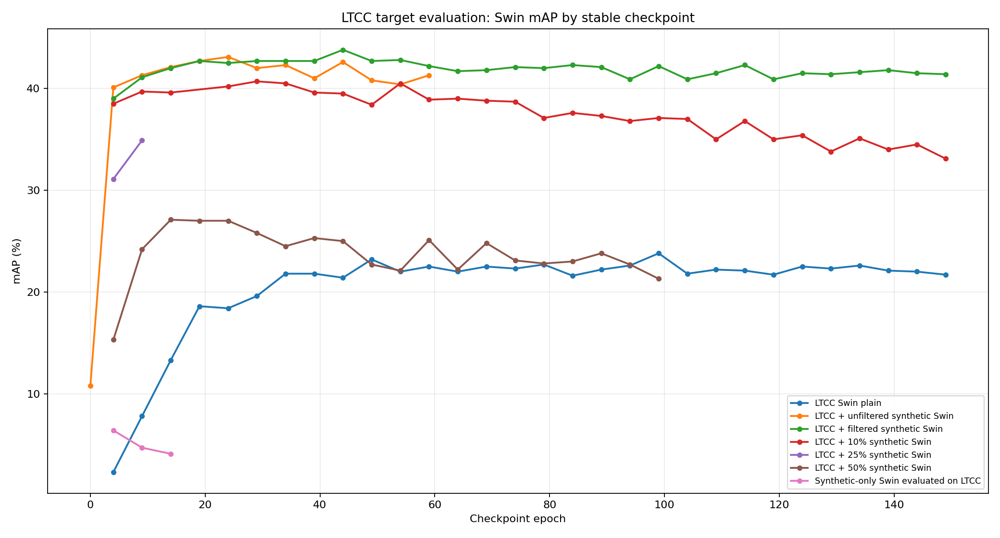

### LTCC Swin Rank-1

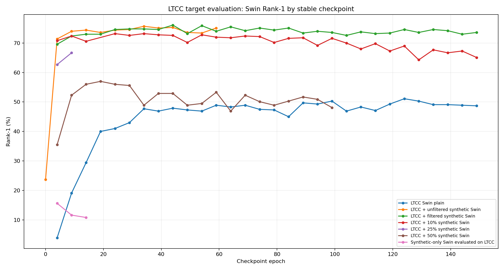

### LTCC Legacy And Transfer mAP

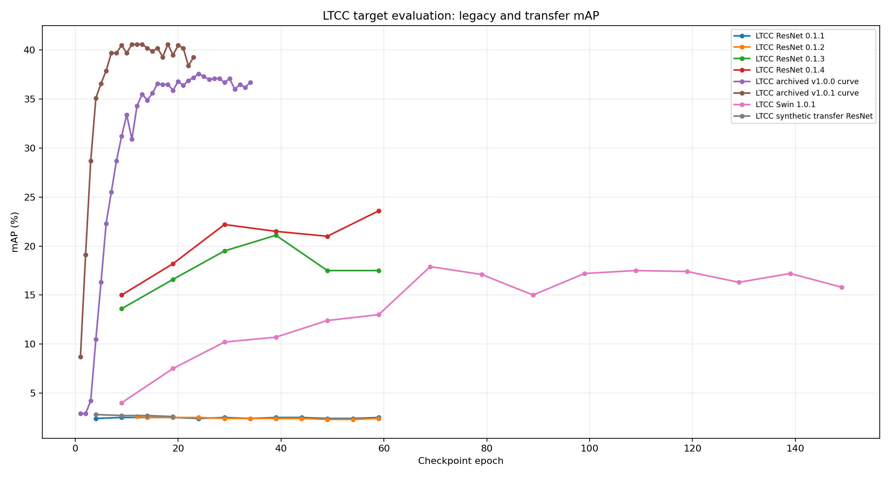

### Duke mAP

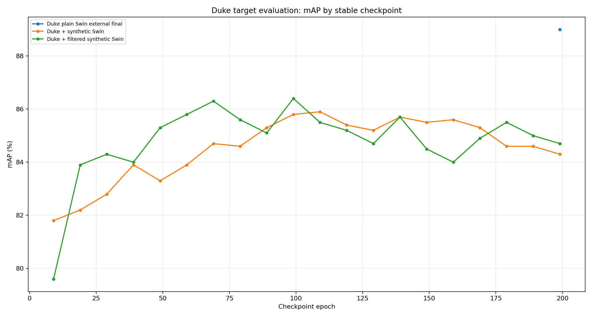

### Duke Rank-1

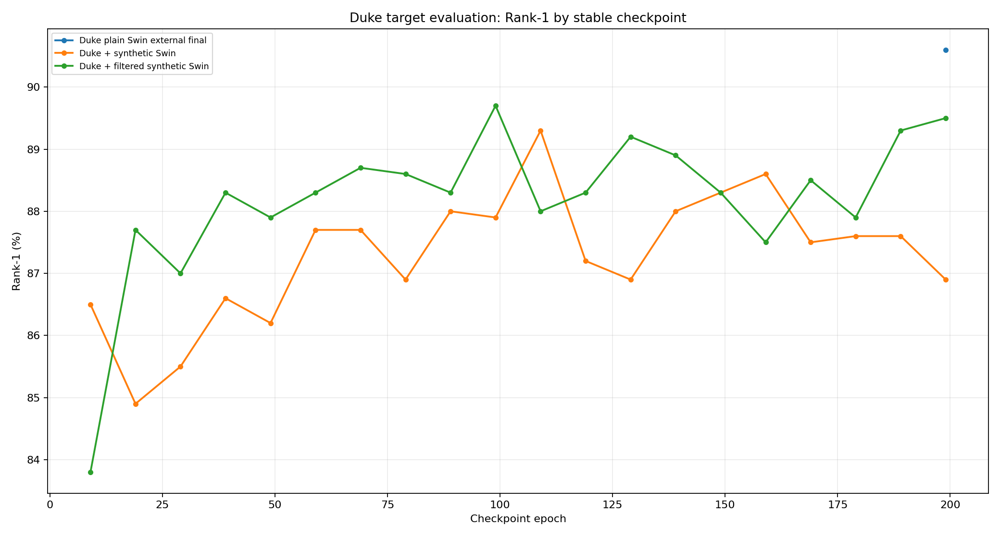

### PRCC And ULIRI Historical mAP

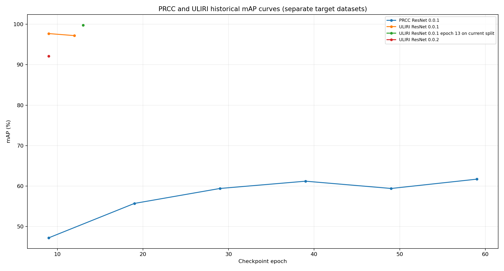

### PRCC Swin mAP

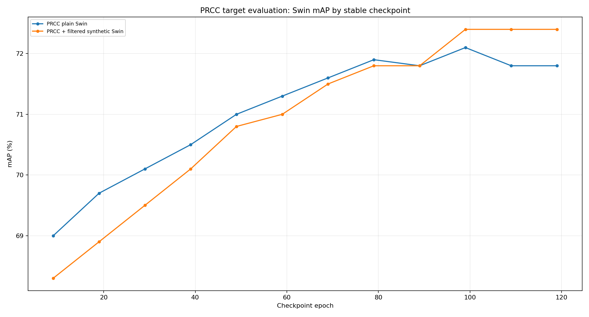

### PRCC Swin Rank-1

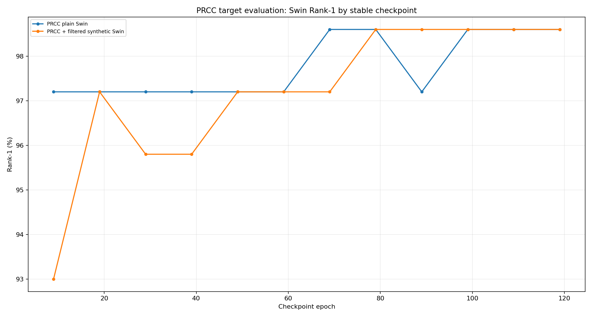

### Generalized Swin Cross-Domain Raw mAP

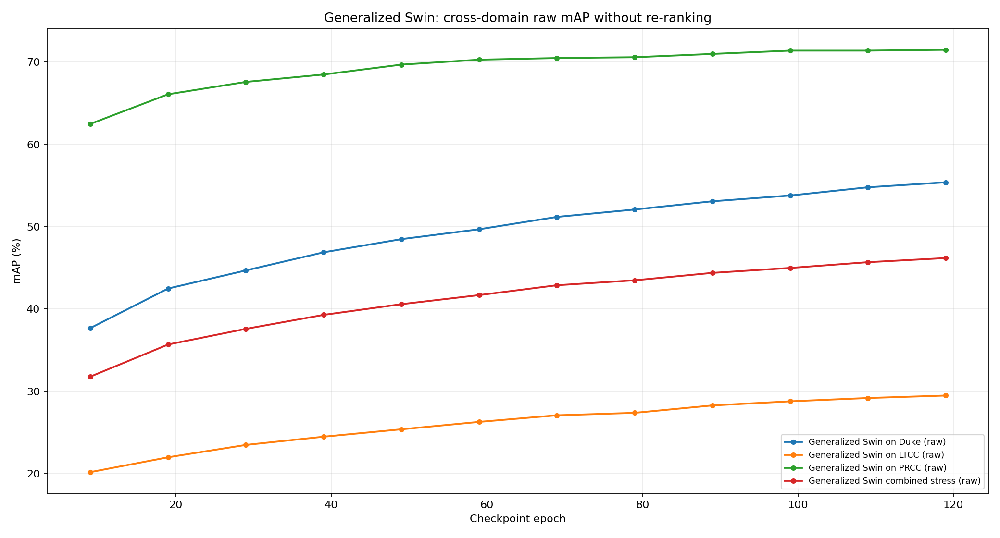

### Generalized Swin Cross-Domain Raw Rank-1

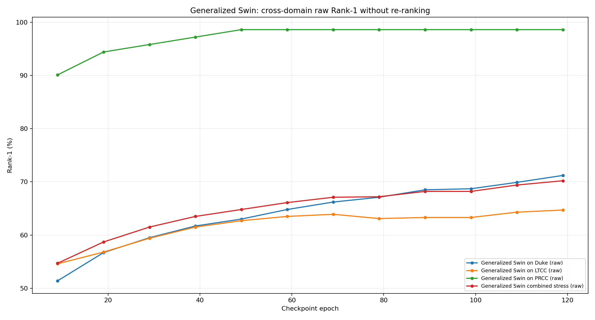

### Synthetic-Only Cross-Dataset Raw mAP

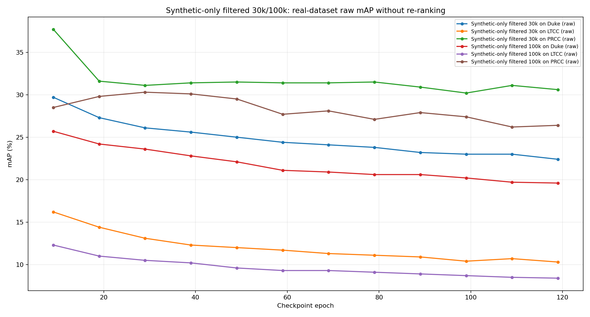

### Synthetic-Only Cross-Dataset Raw Rank-1

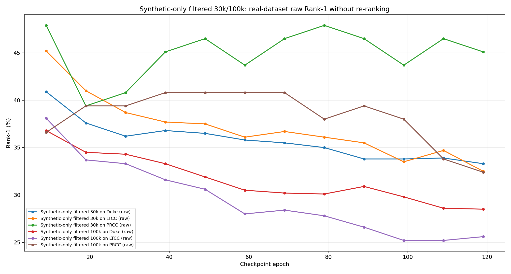

### Local Checkpoint Evaluation Coverage

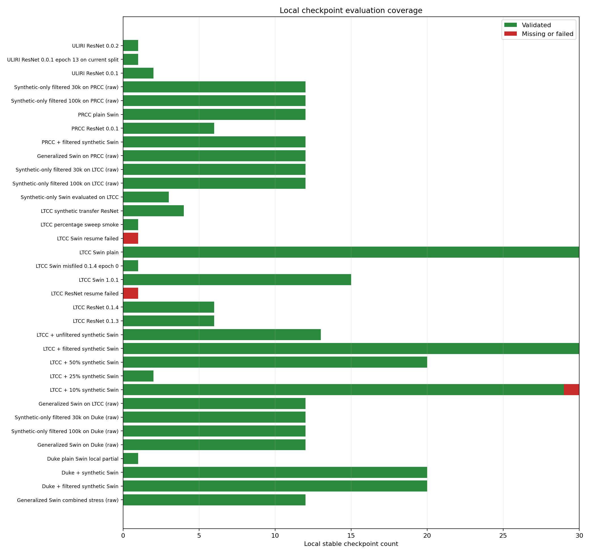

## Experiment Coverage Summary

| Target | Experiment | Local checkpoints | Passed | Failed | Missing | Historical-only | Best checkpoint | Best mAP |
| --- | --- | --- | --- | --- | --- | --- | --- | --- |
| CCVID | CCVID status-only history | 0 | 0 | 0 | 0 | 1 | model_epoch_029_step_50729 | 20.0% |
| CCVID | Pretrained Swin on CCVID (raw) | 0 | 0 | 0 | 0 | 1 | NA | NA |
| Combined stress | Generalized Swin combined stress (raw) | 12 | 12 | 0 | 0 | 0 | model_epoch_119_step_348594 | 46.2% |
| Duke | Duke + filtered synthetic Swin | 20 | 20 | 0 | 0 | 0 | model_epoch_099_step_43340 | 86.4% |
| Duke | Duke + synthetic Swin | 20 | 20 | 0 | 0 | 0 | model_epoch_109_step_61202 | 85.9% |
| Duke | Duke plain Swin external final | 0 | 0 | 0 | 0 | 1 | plain_duke_model_epoch_199_step_10800 | 89.0% |
| Duke | Duke plain Swin local partial | 1 | 1 | 0 | 0 | 0 | model_epoch_004_step_02206 | 10.3% |
| Duke | Generalized Swin on Duke (raw) | 12 | 12 | 0 | 0 | 0 | model_epoch_119_step_348594 | 55.4% |
| Duke | Pretrained Swin on Duke (raw) | 0 | 0 | 0 | 0 | 1 | pretrained_swin_market1501_aicity156 | 4.4% |
| Duke | Synthetic-only filtered 100k on Duke (raw) | 12 | 12 | 0 | 0 | 0 | model_epoch_009_step_18171 | 25.7% |
| Duke | Synthetic-only filtered 30k on Duke (raw) | 12 | 12 | 0 | 0 | 0 | model_epoch_009_step_05501 | 29.7% |
| LTCC | Generalized Swin on LTCC (raw) | 12 | 12 | 0 | 0 | 0 | model_epoch_119_step_348594 | 29.5% |
| LTCC | LTCC + 10% synthetic Swin | 30 | 29 | 1 | 0 | 0 | model_epoch_029_step_59207 | 40.7% |
| LTCC | LTCC + 25% synthetic Swin | 2 | 2 | 0 | 0 | 0 | model_epoch_009_step_40440 | 34.9% |
| LTCC | LTCC + 50% synthetic Swin | 20 | 20 | 0 | 0 | 0 | model_epoch_014_step_112349 | 27.1% |
| LTCC | LTCC + filtered synthetic Swin | 30 | 30 | 0 | 0 | 0 | model_epoch_044_step_20872 | 43.8% |
| LTCC | LTCC + unfiltered synthetic Swin | 13 | 13 | 0 | 0 | 0 | model_epoch_024_step_18820 | 43.1% |
| LTCC | LTCC ResNet 0.1.1 | 0 | 0 | 0 | 0 | 12 | model_epoch_009_step_01337 | 2.5% |
| LTCC | LTCC ResNet 0.1.2 | 0 | 0 | 0 | 0 | 11 | model_epoch_012_step_01700 | 2.6% |
| LTCC | LTCC ResNet 0.1.3 | 6 | 6 | 0 | 0 | 0 | model_epoch_039_step_10831 | 21.1% |
| LTCC | LTCC ResNet 0.1.4 | 6 | 6 | 0 | 0 | 0 | model_epoch_059_step_32791 | 23.6% |
| LTCC | LTCC ResNet resume failed | 1 | 0 | 0 | 1 | 0 | NA | NA |
| LTCC | LTCC Swin 1.0.1 | 15 | 15 | 0 | 0 | 0 | model_epoch_069_step_38346 | 17.9% |
| LTCC | LTCC Swin misfiled 0.1.4 epoch 0 | 1 | 1 | 0 | 0 | 0 | model_epoch_000_step_00000 | 7.1% |
| LTCC | LTCC Swin plain | 30 | 30 | 0 | 0 | 0 | model_epoch_099_step_54742 | 23.8% |
| LTCC | LTCC Swin resume failed | 1 | 0 | 0 | 1 | 0 | NA | NA |
| LTCC | LTCC archived v1.0.0 curve | 0 | 0 | 0 | 0 | 34 | archived_epoch_024 | 37.6% |
| LTCC | LTCC archived v1.0.1 curve | 0 | 0 | 0 | 0 | 23 | archived_epoch_011 | 40.6% |
| LTCC | LTCC percentage sweep smoke | 1 | 1 | 0 | 0 | 0 | model_epoch_001_step_02621 | 5.8% |
| LTCC | LTCC pretrained reference | 0 | 0 | 0 | 0 | 1 | pretrained_reference | 5.6% |
| LTCC | LTCC synthetic transfer ResNet | 4 | 4 | 0 | 0 | 0 | model_epoch_004_step_00185 | 2.8% |
| LTCC | Pretrained Swin marker | 0 | 0 | 0 | 0 | 1 | swin_base_market1501_aicity156_featuredim1024 | 7.5% |
| LTCC | Pretrained Swin on LTCC (raw) | 0 | 0 | 0 | 0 | 1 | pretrained_swin_market1501_aicity156 | 5.4% |
| LTCC | Synthetic-only Swin evaluated on LTCC | 3 | 3 | 0 | 0 | 0 | model_epoch_004_step_22005 | 6.4% |
| LTCC | Synthetic-only filtered 100k on LTCC (raw) | 12 | 12 | 0 | 0 | 0 | model_epoch_009_step_18171 | 12.3% |
| LTCC | Synthetic-only filtered 30k on LTCC (raw) | 12 | 12 | 0 | 0 | 0 | model_epoch_009_step_05501 | 16.2% |
| PRCC | Generalized Swin on PRCC (raw) | 12 | 12 | 0 | 0 | 0 | model_epoch_119_step_348594 | 71.5% |
| PRCC | PRCC + filtered synthetic Swin | 12 | 12 | 0 | 0 | 0 | model_epoch_099_step_58750 | 72.4% |
| PRCC | PRCC ResNet 0.0.1 | 6 | 6 | 0 | 0 | 0 | model_epoch_059_step_85107 | 61.7% |
| PRCC | PRCC plain Swin | 12 | 12 | 0 | 0 | 0 | model_epoch_099_step_46746 | 72.1% |
| PRCC | PRCC pretrained reference | 0 | 0 | 0 | 0 | 1 | pretrained_reference | 12.5% |
| PRCC | Pretrained Swin on PRCC (raw) | 0 | 0 | 0 | 0 | 1 | pretrained_swin_market1501_aicity156 | 18.7% |
| PRCC | Synthetic-only filtered 100k on PRCC (raw) | 12 | 12 | 0 | 0 | 0 | model_epoch_029_step_54551 | 30.3% |
| PRCC | Synthetic-only filtered 30k on PRCC (raw) | 12 | 12 | 0 | 0 | 0 | model_epoch_009_step_05501 | 37.7% |
| Synthetic Market1501 | Pretrained Swin on synthetic Market1501 (raw) | 0 | 0 | 0 | 0 | 1 | pretrained_swin_market1501_aicity156 | 80.5% |
| ULIRI | Pretrained Swin on ULIRI (raw) | 0 | 0 | 0 | 0 | 1 | pretrained_swin_market1501_aicity156 | 12.4% |
| ULIRI | ULIRI ResNet 0.0.1 | 2 | 2 | 0 | 0 | 0 | model_epoch_009_step_29380 | 97.7% |
| ULIRI | ULIRI ResNet 0.0.1 epoch 13 on current split | 1 | 1 | 0 | 0 | 0 | model_epoch_013_step_38333 | 99.8% |
| ULIRI | ULIRI ResNet 0.0.2 | 1 | 1 | 0 | 0 | 0 | model_epoch_009_step_25519 | 92.1% |
| ULIRI | ULIRI ResNet 0.1.1 status-only | 0 | 0 | 0 | 0 | 1 | training_status_latest | 84.5% |
| ULIRI | ULIRI pretrained reference | 0 | 0 | 0 | 0 | 1 | pretrained_reference | 34.2% |

## Generalized Multi-Domain Swin Construction

The generalized Swin experiment trains one model from namespaced Duke, LTCC, and PRCC real training identities plus a deterministic 50% selection of the filtered synthetic pool. Real validation identities are held out before training. Official Duke, LTCC, and PRCC query/gallery folders remain untouched for final target-domain evaluation.

Synthetic, real-training, validation, and combined-stress files use explicit PID and camera namespaces: Duke offsets start at PID `10000` and camera `100`; LTCC at PID `20000` and camera `200`; PRCC at PID `30000` and camera `300`; synthetic data at PID `40000` and camera `400`. The combined stress split is therefore collision-free, but it remains an additional cross-domain stress check rather than an official single-dataset protocol.

### Generalized Dataset Summary

| Split | Images | IDs | Path |
| --- | --- | --- | --- |
| generalized_train | 154258 | 875 | /mnt/2tb_ssd/TwinProject/experiments/reid/generalized_reid_swin/data/train/bounding_box_train |
| validation_query | 93 | 93 | /mnt/2tb_ssd/TwinProject/experiments/reid/generalized_reid_swin/data/validation/query |
| validation_gallery | 3827 | 93 | /mnt/2tb_ssd/TwinProject/experiments/reid/generalized_reid_swin/data/validation/bounding_box_test |
| official_stress_query | 1266 | 848 | /mnt/2tb_ssd/TwinProject/experiments/reid/generalized_reid_swin/data/official_stress/query |
| official_stress_gallery | 28367 | 1256 | /mnt/2tb_ssd/TwinProject/experiments/reid/generalized_reid_swin/data/official_stress/bounding_box_test |

### Identity-Disjoint Real Partition

| Domain | Source train images | Source train IDs | Train images | Train IDs | Validation query | Validation gallery | Validation IDs |
| --- | --- | --- | --- | --- | --- | --- | --- |
| duke | 8784 | 702 | 7892 | 632 | 70 | 822 | 70 |
| ltcc | 9576 | 77 | 8699 | 69 | 8 | 869 | 8 |
| prcc | 22898 | 150 | 20747 | 135 | 15 | 2136 | 15 |

### Generalized Final Raw Retrieval Metrics

| Target split | Checkpoint | mAP | Rank-1 | Rank-5 | Rank-10 |
| --- | --- | --- | --- | --- | --- |
| duke | model_epoch_119_step_348594 | 55.4% | 71.2% | 84.2% | 88.6% |
| ltcc | model_epoch_119_step_348594 | 29.5% | 64.7% | 75.9% | 80.5% |
| prcc | model_epoch_119_step_348594 | 71.5% | 98.6% | 100.0% | 100.0% |
| combined_stress | model_epoch_119_step_348594 | 46.2% | 70.2% | 81.8% | 86.1% |

The generalized checkpoint curves intentionally use raw retrieval metrics without re-ranking. This makes the 48-checkpoint audit practical while training and evaluation share the workstation. Compare these curves internally across generalized checkpoints; do not treat them as directly interchangeable with older re-ranked score tables.

## Filtered Synthetic Data Construction

The filtered LTCC and Duke experiments use the manifest at `datasets/final_syntetic_market1501/manifest.csv`. Rows are grouped by `pid`, `camera_id`, `sequence_id`, `frame_id`, and `source_box_index`. Within each group, the preparation scripts sort by `variant_id`, then keep the three lowest variants. This directly limits repeated versions of the same visual moment while preserving all 39 synthetic identities.

Synthetic PIDs are offset before the files are linked into a combined Market-1501-style training directory. This avoids identity collisions with real LTCC or Duke PIDs. Synthetic query and gallery folders are not used in target-domain validation.

### LTCC Filtered Dataset

| Split | Images | IDs | Path |
| --- | --- | --- | --- |
| ltcc_train | 9576 | 77 | /mnt/2tb_ssd/TwinProject/experiments/reid/ltcc/data/bounding_box_train |
| syntetic_original_train | 233840 | 39 | /mnt/2tb_ssd/TwinProject/datasets/final_syntetic_market1501/bounding_box_train |
| syntetic_filtered_train | 6152 | 39 | /mnt/2tb_ssd/TwinProject/experiments/reid/ltcc_syntetic_filtered_seq/data/filtered_syntetic/bounding_box_train |
| combined_train | 15728 | 116 | /mnt/2tb_ssd/TwinProject/experiments/reid/ltcc_syntetic_filtered_seq/data/ltcc_filtered_syntetic/bounding_box_train |
| ltcc_query | 493 | 75 | /mnt/2tb_ssd/TwinProject/experiments/reid/ltcc/data/query |
| ltcc_gallery | 7026 | 75 | /mnt/2tb_ssd/TwinProject/experiments/reid/ltcc/data/bounding_box_test |

### Duke Filtered Dataset

| Split | Images | IDs | Path |
| --- | --- | --- | --- |
| duke_train | 8784 | 702 | /mnt/2tb_ssd/TwinProject/experiments/reid/duke/data/bounding_box_train |
| syntetic_original_train | 233840 | 39 | /mnt/2tb_ssd/TwinProject/datasets/final_syntetic_market1501/bounding_box_train |
| syntetic_filtered_train | 6152 | 39 | /mnt/2tb_ssd/TwinProject/experiments/reid/duke_syntetic_filtered_seq/data/filtered_syntetic/bounding_box_train |
| combined_train | 14936 | 741 | /mnt/2tb_ssd/TwinProject/experiments/reid/duke_syntetic_filtered_seq/data/duke_filtered_syntetic/bounding_box_train |
| duke_query | 702 | 702 | /mnt/2tb_ssd/TwinProject/experiments/reid/duke/data/query |
| duke_gallery | 10541 | 1110 | /mnt/2tb_ssd/TwinProject/experiments/reid/duke/data/bounding_box_test |

### PRCC Filtered Dataset

| Split | Images | IDs | Path |
| --- | --- | --- | --- |
| prcc_train | 22898 | 150 | /mnt/2tb_ssd/TwinProject/experiments/reid/prcc/data/bounding_box_train |
| syntetic_original_train | 233840 | 39 | /mnt/2tb_ssd/TwinProject/datasets/final_syntetic_market1501/bounding_box_train |
| syntetic_filtered_train | 6152 | 39 | /mnt/2tb_ssd/TwinProject/experiments/reid/prcc_syntetic_filtered_seq/data/filtered_syntetic/bounding_box_train |
| combined_train | 29050 | 189 | /mnt/2tb_ssd/TwinProject/experiments/reid/prcc_syntetic_filtered_seq/data/prcc_filtered_syntetic/bounding_box_train |
| prcc_query | 71 | 71 | /mnt/2tb_ssd/TwinProject/experiments/reid/prcc/data/query |
| prcc_gallery | 10800 | 71 | /mnt/2tb_ssd/TwinProject/experiments/reid/prcc/data/bounding_box_test |

### Original Synthetic Variant Distribution

| Variants available for one person-at-moment group | Group count |
| --- | --- |
| 1 | 5 |
| 47 | 1 |
| 50 | 734 |
| 149 | 12 |
| 150 | 1302 |

The three-variant filter removes **97.37%** of the original synthetic crop volume while preserving the synthetic identity set.

## LTCC Percentage Sweep Construction

The earlier LTCC percentage sweep uses a different policy. It groups synthetic crops by PID and takes the requested percentage from every PID. This keeps every synthetic identity represented while progressively increasing synthetic image volume. The sweep does not use manifest moment grouping, so near-duplicate moment variants remain present.

| Experiment | Synthetic % | LTCC images | Synthetic images | LTCC IDs | Synthetic IDs |
| --- | --- | --- | --- | --- | --- |
| ltcc_syntetic_10 | 10 | 9576 | 23385 | 77 | 39 |
| ltcc_syntetic_25 | 25 | 9576 | 58470 | 77 | 39 |
| ltcc_syntetic_50 | 50 | 9576 | 116924 | 77 | 39 |
| ltcc_syntetic_75 | 75 | 9576 | 175391 | 77 | 39 |
| ltcc_syntetic_100 | 100 | 9576 | 233840 | 77 | 39 |
| syntetic_only_100 | 100 | 0 | 233840 | 0 | 39 |

## Hardware And Evaluation Execution

| Device | Memory | Current report role |
| --- | --- | --- |
| NVIDIA GeForce RTX 3090 | 24,576 MiB | Filtered-LTCC recovery queues and generalized multi-domain Swin training |
| NVIDIA GeForce RTX 5070 | 12,227 MiB | LTCC recovery queues and generalized raw checkpoint validation while GPU 0 trained |

TAO evaluation runs inside `nvcr.io/nvidia/tao/tao-toolkit:6.0.0-pyt`. The checkpoint queues use stable checkpoint files and execute on separate GPU-isolated Docker containers. The report parser deduplicates repeated TSV rows, preferring a passed result when an earlier attempt failed.

## Training Configuration Notes

| Experiment family | Backbone | Input | Epochs | Checkpoint interval | Optimizer | Base LR | Notes |
| --- | --- | --- | --- | --- | --- | --- | --- |
| LTCC plain Swin | `swin_base_patch4_window7_224` | `384x192` | 150 | 5 | SGD | `0.00035` | Real LTCC train only |
| LTCC filtered synthetic | `swin_base_patch4_window7_224` | `384x192` | 150 | 5 | SGD | `0.00035` | LTCC train plus 6,152 filtered synthetic crops |
| LTCC percentage sweep | `swin_base_patch4_window7_224` | `384x192` | 150 planned | 5 | SGD | `0.00035` | Interrupted at different points; synthetic-only rerun used batch 48 |
| Duke filtered synthetic | `swin_base_patch4_window7_224` | `256x128` | 200 | 10 | SGD | `0.001` | Duke train plus 6,152 filtered synthetic crops |
| Duke older synthetic mix | `swin_base_patch4_window7_224` | `256x128` | 200 | 10 | SGD | transferred config | Older combined-data policy |
| PRCC plain Swin | `swin_base_patch4_window7_224` | `256x128` | 120 | 10 | SGD | `0.0006` | Real PRCC train only |
| PRCC filtered synthetic | `swin_base_patch4_window7_224` | `256x128` | 120 | 10 | SGD | `0.0006` | PRCC train plus 6,152 filtered synthetic crops |
| Generalized multi-domain Swin | `swin_base_patch4_window7_224` | `256x128` | 120 | 10 | SGD | `0.0006` | Namespaced Duke + LTCC + PRCC real train, identity-disjoint real validation, and 116,920 synthetic crops selected from the filtered pool |
| Synthetic-only filtered 30k | `swin_base_patch4_window7_224` | `256x128` | 120 | 10 | SGD | `0.0006` | Exactly 30,000 synthetic crops, no real training images; evaluated on real Duke/LTCC/PRCC raw target splits |
| Synthetic-only filtered 100k | `swin_base_patch4_window7_224` | `256x128` | 120 | 10 | SGD | `0.0006` | Exactly 100,000 synthetic crops using lower filtering; training started on GPU 0, evaluation pending |

## Run Status And Known Failures

| Run | Latest status | Latest message | Status file |
| --- | --- | --- | --- |
| CCVID training | SUCCESS | Train finished successfully. | experiments/reid/ccvid/results/train/status.json |
| CCVID evaluation | SUCCESS | Evaluate finished successfully. | experiments/reid/ccvid/results/evaluate/status.json |
| LTCC filtered synthetic | SUCCESS | Train finished successfully. | experiments/reid/ltcc_syntetic_filtered_seq/results/ltcc_filtered_syntetic/train/status.json |
| Duke filtered synthetic | SUCCESS | Train finished successfully. | experiments/reid/duke_syntetic_filtered_seq/results/duke_filtered_syntetic/train/status.json |
| PRCC plain Swin | SUCCESS | Train finished successfully. | experiments/reid/prcc_syntetic_filtered_seq/results/prcc_plain_swin/train/status.json |
| PRCC filtered synthetic Swin | SUCCESS | Train finished successfully. | experiments/reid/prcc_syntetic_filtered_seq/results/prcc_filtered_syntetic_swin/train/status.json |
| Generalized multi-domain Swin | SUCCESS | Train finished successfully. | experiments/reid/generalized_reid_swin/results/generalized_swin/train/status.json |
| LTCC sweep 10% | SUCCESS | Train finished successfully. | experiments/reid/ltcc_syntetic_sweep/results/ltcc_syntetic_10/train/status.json |
| LTCC sweep 25% | FAILURE | CUDA error: unspecified launch failure CUDA kernel errors might be asynchronously reported at some other API call, so the stacktrace below might be incorrect. For debugging consider passing CUDA_LAUNCH_BLOCKING=1 Compile with `TORCH_USE_CUDA_DSA` to enable device-side assertions.  | experiments/reid/ltcc_syntetic_sweep/results/ltcc_syntetic_25/train/status.json |
| LTCC sweep 50% | RUNNING | Train metrics generated. | experiments/reid/ltcc_syntetic_sweep/results/ltcc_syntetic_50/train/status.json |
| LTCC sweep 75% | FAILURE | CUDA error: unspecified launch failure CUDA kernel errors might be asynchronously reported at some other API call, so the stacktrace below might be incorrect. For debugging consider passing CUDA_LAUNCH_BLOCKING=1 Compile with `TORCH_USE_CUDA_DSA` to enable device-side assertions.  | experiments/reid/ltcc_syntetic_sweep/results/ltcc_syntetic_75/train/status.json |
| LTCC sweep 100% | STARTED | Starting Training Loop. | experiments/reid/ltcc_syntetic_sweep/results/ltcc_syntetic_100/train/status.json |
| Synthetic only | RUNNING | Train metrics generated. | experiments/reid/ltcc_syntetic_sweep/results/syntetic_only_100_bs48_gpu0_detached/train/status.json |
| Synthetic-only filtered 30k | SUCCESS | Train finished successfully. | experiments/reid/syntetic_only_filtered_30k/results/syntetic_only_filtered_30k/train/status.json |
| Synthetic-only filtered 100k | SUCCESS | Train finished successfully. | experiments/reid/syntetic_only_filtered_100k/results/syntetic_only_filtered_100k/train/status.json |
| ULIRI 0.0.2 | STARTED | Starting Training Loop. | experiments/reid/uliri/results_0.0.2/train/status.json |

Notable failure history:

- `ltcc_syntetic_10` epoch 19 is a truncated checkpoint. Repeated evaluation attempts fail with `EOFError: Ran out of input`, so it remains marked failed.
- `ltcc_syntetic_10` epoch 139 initially failed on the RTX 5070 during evaluation, then passed on the RTX 3090 at `34.0%` mAP. The final tables retain the successful comparable result.
- `ltcc_syntetic_50` epoch 24 stalled for over an hour during CPU-side re-ranking on the RTX 5070. It passed on the RTX 3090 recovery queue with 27.0% mAP, and the remaining sweep evaluations completed under per-checkpoint timeouts.
- LTCC `results_0.1.4/train/model_epoch_000_step_00000.pth` is a Swin artifact stored beside later ResNet checkpoints. It is evaluated and reported as a separate misfiled series.
- ULIRI `results_0.0.1/train/model_epoch_013_step_38333.pth` carries a 92-class classifier head while the current local config declares 80 classes. The recovery evaluator loads it with `dataset.num_classes=92`.
- ULIRI epoch 13 is reported separately from the older ULIRI `0.0.1` curve because the current local split contains 5,355 query and 12,565 gallery images, while the historical evaluation logs used a smaller split. The current-split retry reached 99.8% mAP and 100.0% Rank-1.
- LTCC `results_0.1.4_syntetic` attempted to resume a ResNet checkpoint into a Swin model and failed with state-dict architecture mismatches.
- LTCC `results_0.1.4_syntetic_resnet` then matched the backbone but failed because the checkpoint classifier had 77 classes while the synthetic-only training set had 7 classes.
- CCVID evaluation history contains repeated GPU out-of-memory attempts before the final recorded status-only metric.
- ULIRI `0.0.2` training history contains a GPU out-of-memory failure.
- The generalized checkpoint sweep disables TAO CPU-side re-ranking and sampled match-grid images. Re-ranking made repeated full checkpoint validation CPU-bound, while sampled match-grid generation created one visual row per query and added avoidable overhead.

## Full Checkpoint Tables

Every available evaluated checkpoint is listed below. Local checkpoints without a comparable evaluation are included with `missing` status.

### CCVID status-only history

| Epoch | Checkpoint | mAP | Rank-1 | Rank-5 | Rank-10 | Status | Local checkpoint path |
| --- | --- | --- | --- | --- | --- | --- | --- |
| 29 | model_epoch_029_step_50729 | 20.0% | NA | NA | NA | passed | checkpoint not stored locally |

### Pretrained Swin on CCVID (raw)

| Epoch | Checkpoint | mAP | Rank-1 | Rank-5 | Rank-10 | Status | Local checkpoint path |
| --- | --- | --- | --- | --- | --- | --- | --- |
| NA | pretrained_swin_market1501_aicity156 | NA | NA | NA | NA | failed | checkpoint not stored locally |

### Generalized Swin combined stress (raw)

| Epoch | Checkpoint | mAP | Rank-1 | Rank-5 | Rank-10 | Status | Local checkpoint path |
| --- | --- | --- | --- | --- | --- | --- | --- |
| 9 | model_epoch_009_step_29073 | 31.8% | 54.7% | 69.7% | 75.6% | passed | experiments/reid/generalized_reid_swin/results/generalized_swin/train/model_epoch_009_step_29073.pth |
| 19 | model_epoch_019_step_58078 | 35.7% | 58.7% | 73.8% | 78.8% | passed | experiments/reid/generalized_reid_swin/results/generalized_swin/train/model_epoch_019_step_58078.pth |
| 29 | model_epoch_029_step_87117 | 37.6% | 61.5% | 76.9% | 81.8% | passed | experiments/reid/generalized_reid_swin/results/generalized_swin/train/model_epoch_029_step_87117.pth |
| 39 | model_epoch_039_step_116118 | 39.3% | 63.5% | 77.9% | 83.2% | passed | experiments/reid/generalized_reid_swin/results/generalized_swin/train/model_epoch_039_step_116118.pth |
| 49 | model_epoch_049_step_145132 | 40.6% | 64.8% | 79.5% | 83.7% | passed | experiments/reid/generalized_reid_swin/results/generalized_swin/train/model_epoch_049_step_145132.pth |
| 59 | model_epoch_059_step_174216 | 41.7% | 66.1% | 79.9% | 84.2% | passed | experiments/reid/generalized_reid_swin/results/generalized_swin/train/model_epoch_059_step_174216.pth |
| 69 | model_epoch_069_step_203291 | 42.9% | 67.1% | 80.9% | 84.4% | passed | experiments/reid/generalized_reid_swin/results/generalized_swin/train/model_epoch_069_step_203291.pth |
| 79 | model_epoch_079_step_232299 | 43.5% | 67.2% | 80.8% | 84.7% | passed | experiments/reid/generalized_reid_swin/results/generalized_swin/train/model_epoch_079_step_232299.pth |
| 89 | model_epoch_089_step_261419 | 44.4% | 68.2% | 81.6% | 85.3% | passed | experiments/reid/generalized_reid_swin/results/generalized_swin/train/model_epoch_089_step_261419.pth |
| 99 | model_epoch_099_step_290419 | 45.0% | 68.2% | 82.0% | 85.4% | passed | experiments/reid/generalized_reid_swin/results/generalized_swin/train/model_epoch_099_step_290419.pth |
| 109 | model_epoch_109_step_319465 | 45.7% | 69.4% | 82.3% | 85.9% | passed | experiments/reid/generalized_reid_swin/results/generalized_swin/train/model_epoch_109_step_319465.pth |
| 119 | model_epoch_119_step_348594 | 46.2% | 70.2% | 81.8% | 86.1% | passed | experiments/reid/generalized_reid_swin/results/generalized_swin/train/model_epoch_119_step_348594.pth |

### Duke + filtered synthetic Swin

| Epoch | Checkpoint | mAP | Rank-1 | Rank-5 | Rank-10 | Status | Local checkpoint path |
| --- | --- | --- | --- | --- | --- | --- | --- |
| 9 | model_epoch_009_step_04327 | 79.6% | 83.8% | 90.7% | 93.2% | passed | experiments/reid/duke_syntetic_filtered_seq/results/duke_filtered_syntetic/train/model_epoch_009_step_04327.pth |
| 19 | model_epoch_019_step_08660 | 83.9% | 87.7% | 92.5% | 94.0% | passed | experiments/reid/duke_syntetic_filtered_seq/results/duke_filtered_syntetic/train/model_epoch_019_step_08660.pth |
| 29 | model_epoch_029_step_12985 | 84.3% | 87.0% | 92.9% | 94.7% | passed | experiments/reid/duke_syntetic_filtered_seq/results/duke_filtered_syntetic/train/model_epoch_029_step_12985.pth |
| 39 | model_epoch_039_step_17318 | 84.0% | 88.3% | 92.6% | 94.2% | passed | experiments/reid/duke_syntetic_filtered_seq/results/duke_filtered_syntetic/train/model_epoch_039_step_17318.pth |
| 49 | model_epoch_049_step_21654 | 85.3% | 87.9% | 93.3% | 94.7% | passed | experiments/reid/duke_syntetic_filtered_seq/results/duke_filtered_syntetic/train/model_epoch_049_step_21654.pth |
| 59 | model_epoch_059_step_25970 | 85.8% | 88.3% | 94.2% | 95.3% | passed | experiments/reid/duke_syntetic_filtered_seq/results/duke_filtered_syntetic/train/model_epoch_059_step_25970.pth |
| 69 | model_epoch_069_step_30310 | 86.3% | 88.7% | 93.9% | 95.6% | passed | experiments/reid/duke_syntetic_filtered_seq/results/duke_filtered_syntetic/train/model_epoch_069_step_30310.pth |
| 79 | model_epoch_079_step_34658 | 85.6% | 88.6% | 94.0% | 95.0% | passed | experiments/reid/duke_syntetic_filtered_seq/results/duke_filtered_syntetic/train/model_epoch_079_step_34658.pth |
| 89 | model_epoch_089_step_38996 | 85.1% | 88.3% | 93.4% | 94.7% | passed | experiments/reid/duke_syntetic_filtered_seq/results/duke_filtered_syntetic/train/model_epoch_089_step_38996.pth |
| 99 | model_epoch_099_step_43340 | 86.4% | 89.7% | 94.4% | 95.3% | passed | experiments/reid/duke_syntetic_filtered_seq/results/duke_filtered_syntetic/train/model_epoch_099_step_43340.pth |
| 109 | model_epoch_109_step_47673 | 85.5% | 88.0% | 93.4% | 94.4% | passed | experiments/reid/duke_syntetic_filtered_seq/results/duke_filtered_syntetic/train/model_epoch_109_step_47673.pth |
| 119 | model_epoch_119_step_52003 | 85.2% | 88.3% | 93.4% | 94.9% | passed | experiments/reid/duke_syntetic_filtered_seq/results/duke_filtered_syntetic/train/model_epoch_119_step_52003.pth |
| 129 | model_epoch_129_step_56349 | 84.7% | 89.2% | 92.9% | 94.6% | passed | experiments/reid/duke_syntetic_filtered_seq/results/duke_filtered_syntetic/train/model_epoch_129_step_56349.pth |
| 139 | model_epoch_139_step_60691 | 85.7% | 88.9% | 93.4% | 94.7% | passed | experiments/reid/duke_syntetic_filtered_seq/results/duke_filtered_syntetic/train/model_epoch_139_step_60691.pth |
| 149 | model_epoch_149_step_65017 | 84.5% | 88.3% | 92.6% | 94.0% | passed | experiments/reid/duke_syntetic_filtered_seq/results/duke_filtered_syntetic/train/model_epoch_149_step_65017.pth |
| 159 | model_epoch_159_step_69359 | 84.0% | 87.5% | 92.0% | 94.7% | passed | experiments/reid/duke_syntetic_filtered_seq/results/duke_filtered_syntetic/train/model_epoch_159_step_69359.pth |
| 169 | model_epoch_169_step_73692 | 84.9% | 88.5% | 93.6% | 94.6% | passed | experiments/reid/duke_syntetic_filtered_seq/results/duke_filtered_syntetic/train/model_epoch_169_step_73692.pth |
| 179 | model_epoch_179_step_78016 | 85.5% | 87.9% | 93.3% | 94.0% | passed | experiments/reid/duke_syntetic_filtered_seq/results/duke_filtered_syntetic/train/model_epoch_179_step_78016.pth |
| 189 | model_epoch_189_step_82366 | 85.0% | 89.3% | 93.4% | 94.4% | passed | experiments/reid/duke_syntetic_filtered_seq/results/duke_filtered_syntetic/train/model_epoch_189_step_82366.pth |
| 199 | model_epoch_199_step_86706 | 84.7% | 89.5% | 93.2% | 94.6% | passed | experiments/reid/duke_syntetic_filtered_seq/results/duke_filtered_syntetic/train/model_epoch_199_step_86706.pth |

### Duke + synthetic Swin

| Epoch | Checkpoint | mAP | Rank-1 | Rank-5 | Rank-10 | Status | Local checkpoint path |
| --- | --- | --- | --- | --- | --- | --- | --- |
| 9 | model_epoch_009_step_05566 | 81.8% | 86.5% | 91.9% | 93.9% | passed | experiments/reid/duke+syntetic/results_swin_working_lowbatch/train/model_epoch_009_step_05566.pth |
| 19 | model_epoch_019_step_11134 | 82.2% | 84.9% | 92.3% | 93.7% | passed | experiments/reid/duke+syntetic/results_swin_working_lowbatch/train/model_epoch_019_step_11134.pth |
| 29 | model_epoch_029_step_16701 | 82.8% | 85.5% | 92.6% | 94.7% | passed | experiments/reid/duke+syntetic/results_swin_working_lowbatch/train/model_epoch_029_step_16701.pth |
| 39 | model_epoch_039_step_22270 | 83.9% | 86.6% | 92.5% | 94.3% | passed | experiments/reid/duke+syntetic/results_swin_working_lowbatch/train/model_epoch_039_step_22270.pth |
| 49 | model_epoch_049_step_27833 | 83.3% | 86.2% | 92.5% | 93.9% | passed | experiments/reid/duke+syntetic/results_swin_working_lowbatch/train/model_epoch_049_step_27833.pth |
| 59 | model_epoch_059_step_33396 | 83.9% | 87.7% | 92.7% | 94.3% | passed | experiments/reid/duke+syntetic/results_swin_working_lowbatch/train/model_epoch_059_step_33396.pth |
| 69 | model_epoch_069_step_38962 | 84.7% | 87.7% | 93.2% | 95.3% | passed | experiments/reid/duke+syntetic/results_swin_working_lowbatch/train/model_epoch_069_step_38962.pth |
| 79 | model_epoch_079_step_44521 | 84.6% | 86.9% | 92.6% | 95.0% | passed | experiments/reid/duke+syntetic/results_swin_working_lowbatch/train/model_epoch_079_step_44521.pth |
| 89 | model_epoch_089_step_50084 | 85.3% | 88.0% | 93.3% | 94.3% | passed | experiments/reid/duke+syntetic/results_swin_working_lowbatch/train/model_epoch_089_step_50084.pth |
| 99 | model_epoch_099_step_55641 | 85.8% | 87.9% | 93.2% | 94.4% | passed | experiments/reid/duke+syntetic/results_swin_working_lowbatch/train/model_epoch_099_step_55641.pth |
| 109 | model_epoch_109_step_61202 | 85.9% | 89.3% | 93.4% | 95.6% | passed | experiments/reid/duke+syntetic/results_swin_working_lowbatch/train/model_epoch_109_step_61202.pth |
| 119 | model_epoch_119_step_66761 | 85.4% | 87.2% | 93.6% | 95.3% | passed | experiments/reid/duke+syntetic/results_swin_working_lowbatch/train/model_epoch_119_step_66761.pth |
| 129 | model_epoch_129_step_72328 | 85.2% | 86.9% | 93.2% | 94.6% | passed | experiments/reid/duke+syntetic/results_swin_working_lowbatch/train/model_epoch_129_step_72328.pth |
| 139 | model_epoch_139_step_77890 | 85.7% | 88.0% | 93.3% | 95.4% | passed | experiments/reid/duke+syntetic/results_swin_working_lowbatch/train/model_epoch_139_step_77890.pth |
| 149 | model_epoch_149_step_83456 | 85.5% | 88.3% | 93.3% | 95.0% | passed | experiments/reid/duke+syntetic/results_swin_working_lowbatch/train/model_epoch_149_step_83456.pth |
| 159 | model_epoch_159_step_89021 | 85.6% | 88.6% | 93.0% | 94.6% | passed | experiments/reid/duke+syntetic/results_swin_working_lowbatch/train/model_epoch_159_step_89021.pth |
| 169 | model_epoch_169_step_94588 | 85.3% | 87.5% | 93.4% | 95.3% | passed | experiments/reid/duke+syntetic/results_swin_working_lowbatch/train/model_epoch_169_step_94588.pth |
| 179 | model_epoch_179_step_100150 | 84.6% | 87.6% | 93.6% | 95.0% | passed | experiments/reid/duke+syntetic/results_swin_working_lowbatch/train/model_epoch_179_step_100150.pth |
| 189 | model_epoch_189_step_105716 | 84.6% | 87.6% | 93.3% | 94.0% | passed | experiments/reid/duke+syntetic/results_swin_working_lowbatch/train/model_epoch_189_step_105716.pth |
| 199 | model_epoch_199_step_111283 | 84.3% | 86.9% | 92.5% | 94.4% | passed | experiments/reid/duke+syntetic/results_swin_working_lowbatch/train/model_epoch_199_step_111283.pth |

### Duke plain Swin external final

| Epoch | Checkpoint | mAP | Rank-1 | Rank-5 | Rank-10 | Status | Local checkpoint path |
| --- | --- | --- | --- | --- | --- | --- | --- |
| 199 | plain_duke_model_epoch_199_step_10800 | 89.0% | 90.6% | 95.6% | 96.6% | passed | checkpoint not stored locally |

### Duke plain Swin local partial

| Epoch | Checkpoint | mAP | Rank-1 | Rank-5 | Rank-10 | Status | Local checkpoint path |
| --- | --- | --- | --- | --- | --- | --- | --- |
| 4 | model_epoch_004_step_02206 | 10.3% | 12.4% | 22.4% | 27.9% | passed | experiments/reid/duke/results_plain/train/model_epoch_004_step_02206.pth |

### Generalized Swin on Duke (raw)

| Epoch | Checkpoint | mAP | Rank-1 | Rank-5 | Rank-10 | Status | Local checkpoint path |
| --- | --- | --- | --- | --- | --- | --- | --- |
| 9 | model_epoch_009_step_29073 | 37.7% | 51.4% | 69.4% | 75.8% | passed | experiments/reid/generalized_reid_swin/results/generalized_swin/train/model_epoch_009_step_29073.pth |
| 19 | model_epoch_019_step_58078 | 42.5% | 56.7% | 75.1% | 80.2% | passed | experiments/reid/generalized_reid_swin/results/generalized_swin/train/model_epoch_019_step_58078.pth |
| 29 | model_epoch_029_step_87117 | 44.7% | 59.5% | 77.4% | 82.2% | passed | experiments/reid/generalized_reid_swin/results/generalized_swin/train/model_epoch_029_step_87117.pth |
| 39 | model_epoch_039_step_116118 | 46.9% | 61.7% | 78.5% | 83.8% | passed | experiments/reid/generalized_reid_swin/results/generalized_swin/train/model_epoch_039_step_116118.pth |
| 49 | model_epoch_049_step_145132 | 48.5% | 63.0% | 79.9% | 84.3% | passed | experiments/reid/generalized_reid_swin/results/generalized_swin/train/model_epoch_049_step_145132.pth |
| 59 | model_epoch_059_step_174216 | 49.7% | 64.8% | 81.2% | 85.0% | passed | experiments/reid/generalized_reid_swin/results/generalized_swin/train/model_epoch_059_step_174216.pth |
| 69 | model_epoch_069_step_203291 | 51.2% | 66.2% | 82.8% | 85.5% | passed | experiments/reid/generalized_reid_swin/results/generalized_swin/train/model_epoch_069_step_203291.pth |
| 79 | model_epoch_079_step_232299 | 52.1% | 67.1% | 83.2% | 86.0% | passed | experiments/reid/generalized_reid_swin/results/generalized_swin/train/model_epoch_079_step_232299.pth |
| 89 | model_epoch_089_step_261419 | 53.1% | 68.5% | 83.6% | 87.0% | passed | experiments/reid/generalized_reid_swin/results/generalized_swin/train/model_epoch_089_step_261419.pth |
| 99 | model_epoch_099_step_290419 | 53.8% | 68.7% | 84.2% | 87.3% | passed | experiments/reid/generalized_reid_swin/results/generalized_swin/train/model_epoch_099_step_290419.pth |
| 109 | model_epoch_109_step_319465 | 54.8% | 69.9% | 84.5% | 87.9% | passed | experiments/reid/generalized_reid_swin/results/generalized_swin/train/model_epoch_109_step_319465.pth |
| 119 | model_epoch_119_step_348594 | 55.4% | 71.2% | 84.2% | 88.6% | passed | experiments/reid/generalized_reid_swin/results/generalized_swin/train/model_epoch_119_step_348594.pth |

### Pretrained Swin on Duke (raw)

| Epoch | Checkpoint | mAP | Rank-1 | Rank-5 | Rank-10 | Status | Local checkpoint path |
| --- | --- | --- | --- | --- | --- | --- | --- |
| NA | pretrained_swin_market1501_aicity156 | 4.4% | 11.3% | 18.9% | 22.9% | passed | checkpoint not stored locally |

### Synthetic-only filtered 100k on Duke (raw)

| Epoch | Checkpoint | mAP | Rank-1 | Rank-5 | Rank-10 | Status | Local checkpoint path |
| --- | --- | --- | --- | --- | --- | --- | --- |
| 9 | model_epoch_009_step_18171 | 25.7% | 36.8% | 53.0% | 60.1% | passed | experiments/reid/syntetic_only_filtered_100k/results/syntetic_only_filtered_100k/train/model_epoch_009_step_18171.pth |
| 19 | model_epoch_019_step_36353 | 24.2% | 34.5% | 52.3% | 59.8% | passed | experiments/reid/syntetic_only_filtered_100k/results/syntetic_only_filtered_100k/train/model_epoch_019_step_36353.pth |
| 29 | model_epoch_029_step_54551 | 23.6% | 34.3% | 52.1% | 59.5% | passed | experiments/reid/syntetic_only_filtered_100k/results/syntetic_only_filtered_100k/train/model_epoch_029_step_54551.pth |
| 39 | model_epoch_039_step_72675 | 22.8% | 33.3% | 50.3% | 57.4% | passed | experiments/reid/syntetic_only_filtered_100k/results/syntetic_only_filtered_100k/train/model_epoch_039_step_72675.pth |
| 49 | model_epoch_049_step_90868 | 22.1% | 31.9% | 49.3% | 56.3% | passed | experiments/reid/syntetic_only_filtered_100k/results/syntetic_only_filtered_100k/train/model_epoch_049_step_90868.pth |
| 59 | model_epoch_059_step_109028 | 21.1% | 30.5% | 47.6% | 55.6% | passed | experiments/reid/syntetic_only_filtered_100k/results/syntetic_only_filtered_100k/train/model_epoch_059_step_109028.pth |
| 69 | model_epoch_069_step_127099 | 20.9% | 30.2% | 46.9% | 55.1% | passed | experiments/reid/syntetic_only_filtered_100k/results/syntetic_only_filtered_100k/train/model_epoch_069_step_127099.pth |
| 79 | model_epoch_079_step_145286 | 20.6% | 30.1% | 46.4% | 54.7% | passed | experiments/reid/syntetic_only_filtered_100k/results/syntetic_only_filtered_100k/train/model_epoch_079_step_145286.pth |
| 89 | model_epoch_089_step_163504 | 20.6% | 30.9% | 47.2% | 54.3% | passed | experiments/reid/syntetic_only_filtered_100k/results/syntetic_only_filtered_100k/train/model_epoch_089_step_163504.pth |
| 99 | model_epoch_099_step_181644 | 20.2% | 29.8% | 47.4% | 54.6% | passed | experiments/reid/syntetic_only_filtered_100k/results/syntetic_only_filtered_100k/train/model_epoch_099_step_181644.pth |
| 109 | model_epoch_109_step_199817 | 19.7% | 28.6% | 46.0% | 53.4% | passed | experiments/reid/syntetic_only_filtered_100k/results/syntetic_only_filtered_100k/train/model_epoch_109_step_199817.pth |
| 119 | model_epoch_119_step_217996 | 19.6% | 28.5% | 46.3% | 53.3% | passed | experiments/reid/syntetic_only_filtered_100k/results/syntetic_only_filtered_100k/train/model_epoch_119_step_217996.pth |

### Synthetic-only filtered 30k on Duke (raw)

| Epoch | Checkpoint | mAP | Rank-1 | Rank-5 | Rank-10 | Status | Local checkpoint path |
| --- | --- | --- | --- | --- | --- | --- | --- |
| 9 | model_epoch_009_step_05501 | 29.7% | 40.9% | 58.8% | 65.2% | passed | experiments/reid/syntetic_only_filtered_30k/results/syntetic_only_filtered_30k/train/model_epoch_009_step_05501.pth |
| 19 | model_epoch_019_step_11006 | 27.3% | 37.6% | 56.6% | 62.8% | passed | experiments/reid/syntetic_only_filtered_30k/results/syntetic_only_filtered_30k/train/model_epoch_019_step_11006.pth |
| 29 | model_epoch_029_step_16495 | 26.1% | 36.2% | 54.3% | 61.1% | passed | experiments/reid/syntetic_only_filtered_30k/results/syntetic_only_filtered_30k/train/model_epoch_029_step_16495.pth |
| 39 | model_epoch_039_step_21976 | 25.6% | 36.8% | 53.4% | 61.0% | passed | experiments/reid/syntetic_only_filtered_30k/results/syntetic_only_filtered_30k/train/model_epoch_039_step_21976.pth |
| 49 | model_epoch_049_step_27414 | 25.0% | 36.5% | 53.3% | 60.0% | passed | experiments/reid/syntetic_only_filtered_30k/results/syntetic_only_filtered_30k/train/model_epoch_049_step_27414.pth |
| 59 | model_epoch_059_step_32887 | 24.4% | 35.8% | 52.7% | 60.4% | passed | experiments/reid/syntetic_only_filtered_30k/results/syntetic_only_filtered_30k/train/model_epoch_059_step_32887.pth |
| 69 | model_epoch_069_step_38378 | 24.1% | 35.5% | 52.4% | 60.3% | passed | experiments/reid/syntetic_only_filtered_30k/results/syntetic_only_filtered_30k/train/model_epoch_069_step_38378.pth |
| 79 | model_epoch_079_step_43857 | 23.8% | 35.0% | 51.7% | 60.1% | passed | experiments/reid/syntetic_only_filtered_30k/results/syntetic_only_filtered_30k/train/model_epoch_079_step_43857.pth |
| 89 | model_epoch_089_step_49333 | 23.2% | 33.8% | 51.6% | 60.0% | passed | experiments/reid/syntetic_only_filtered_30k/results/syntetic_only_filtered_30k/train/model_epoch_089_step_49333.pth |
| 99 | model_epoch_099_step_54772 | 23.0% | 33.8% | 51.1% | 59.8% | passed | experiments/reid/syntetic_only_filtered_30k/results/syntetic_only_filtered_30k/train/model_epoch_099_step_54772.pth |
| 109 | model_epoch_109_step_60250 | 23.0% | 33.9% | 51.7% | 59.5% | passed | experiments/reid/syntetic_only_filtered_30k/results/syntetic_only_filtered_30k/train/model_epoch_109_step_60250.pth |
| 119 | model_epoch_119_step_65750 | 22.4% | 33.3% | 51.3% | 58.7% | passed | experiments/reid/syntetic_only_filtered_30k/results/syntetic_only_filtered_30k/train/model_epoch_119_step_65750.pth |

### Generalized Swin on LTCC (raw)

| Epoch | Checkpoint | mAP | Rank-1 | Rank-5 | Rank-10 | Status | Local checkpoint path |
| --- | --- | --- | --- | --- | --- | --- | --- |
| 9 | model_epoch_009_step_29073 | 20.2% | 54.6% | 67.3% | 73.0% | passed | experiments/reid/generalized_reid_swin/results/generalized_swin/train/model_epoch_009_step_29073.pth |
| 19 | model_epoch_019_step_58078 | 22.0% | 56.8% | 69.2% | 74.4% | passed | experiments/reid/generalized_reid_swin/results/generalized_swin/train/model_epoch_019_step_58078.pth |
| 29 | model_epoch_029_step_87117 | 23.5% | 59.4% | 73.2% | 78.5% | passed | experiments/reid/generalized_reid_swin/results/generalized_swin/train/model_epoch_029_step_87117.pth |
| 39 | model_epoch_039_step_116118 | 24.5% | 61.5% | 74.0% | 79.9% | passed | experiments/reid/generalized_reid_swin/results/generalized_swin/train/model_epoch_039_step_116118.pth |
| 49 | model_epoch_049_step_145132 | 25.4% | 62.7% | 75.9% | 80.5% | passed | experiments/reid/generalized_reid_swin/results/generalized_swin/train/model_epoch_049_step_145132.pth |
| 59 | model_epoch_059_step_174216 | 26.3% | 63.5% | 75.5% | 80.7% | passed | experiments/reid/generalized_reid_swin/results/generalized_swin/train/model_epoch_059_step_174216.pth |
| 69 | model_epoch_069_step_203291 | 27.1% | 63.9% | 75.7% | 80.7% | passed | experiments/reid/generalized_reid_swin/results/generalized_swin/train/model_epoch_069_step_203291.pth |
| 79 | model_epoch_079_step_232299 | 27.4% | 63.1% | 74.6% | 80.7% | passed | experiments/reid/generalized_reid_swin/results/generalized_swin/train/model_epoch_079_step_232299.pth |
| 89 | model_epoch_089_step_261419 | 28.3% | 63.3% | 76.3% | 80.7% | passed | experiments/reid/generalized_reid_swin/results/generalized_swin/train/model_epoch_089_step_261419.pth |
| 99 | model_epoch_099_step_290419 | 28.8% | 63.3% | 76.3% | 80.5% | passed | experiments/reid/generalized_reid_swin/results/generalized_swin/train/model_epoch_099_step_290419.pth |
| 109 | model_epoch_109_step_319465 | 29.2% | 64.3% | 76.7% | 80.9% | passed | experiments/reid/generalized_reid_swin/results/generalized_swin/train/model_epoch_109_step_319465.pth |
| 119 | model_epoch_119_step_348594 | 29.5% | 64.7% | 75.9% | 80.5% | passed | experiments/reid/generalized_reid_swin/results/generalized_swin/train/model_epoch_119_step_348594.pth |

### LTCC + 10% synthetic Swin

| Epoch | Checkpoint | mAP | Rank-1 | Rank-5 | Rank-10 | Status | Local checkpoint path |
| --- | --- | --- | --- | --- | --- | --- | --- |
| 4 | model_epoch_004_step_09879 | 38.5% | 70.8% | 77.7% | 79.7% | passed | experiments/reid/ltcc_syntetic_sweep/results/ltcc_syntetic_10/train/model_epoch_004_step_09879.pth |
| 9 | model_epoch_009_step_19730 | 39.7% | 72.4% | 77.5% | 79.7% | passed | experiments/reid/ltcc_syntetic_sweep/results/ltcc_syntetic_10/train/model_epoch_009_step_19730.pth |
| 14 | model_epoch_014_step_29612 | 39.6% | 70.6% | 77.7% | 80.3% | passed | experiments/reid/ltcc_syntetic_sweep/results/ltcc_syntetic_10/train/model_epoch_014_step_29612.pth |
| 19 | model_epoch_019_step_39478 | NA | NA | NA | NA | failed | experiments/reid/ltcc_syntetic_sweep/results/ltcc_syntetic_10/train/model_epoch_019_step_39478.pth |
| 24 | model_epoch_024_step_49336 | 40.2% | 73.2% | 78.9% | 81.1% | passed | experiments/reid/ltcc_syntetic_sweep/results/ltcc_syntetic_10/train/model_epoch_024_step_49336.pth |
| 29 | model_epoch_029_step_59207 | 40.7% | 72.6% | 80.3% | 82.4% | passed | experiments/reid/ltcc_syntetic_sweep/results/ltcc_syntetic_10/train/model_epoch_029_step_59207.pth |
| 34 | model_epoch_034_step_69098 | 40.5% | 73.2% | 79.1% | 81.9% | passed | experiments/reid/ltcc_syntetic_sweep/results/ltcc_syntetic_10/train/model_epoch_034_step_69098.pth |
| 39 | model_epoch_039_step_78942 | 39.6% | 72.8% | 79.9% | 82.8% | passed | experiments/reid/ltcc_syntetic_sweep/results/ltcc_syntetic_10/train/model_epoch_039_step_78942.pth |
| 44 | model_epoch_044_step_88790 | 39.5% | 72.6% | 79.3% | 81.1% | passed | experiments/reid/ltcc_syntetic_sweep/results/ltcc_syntetic_10/train/model_epoch_044_step_88790.pth |
| 49 | model_epoch_049_step_98636 | 38.4% | 70.2% | 77.9% | 81.7% | passed | experiments/reid/ltcc_syntetic_sweep/results/ltcc_syntetic_10/train/model_epoch_049_step_98636.pth |
| 54 | model_epoch_054_step_108508 | 40.5% | 72.8% | 79.3% | 82.2% | passed | experiments/reid/ltcc_syntetic_sweep/results/ltcc_syntetic_10/train/model_epoch_054_step_108508.pth |
| 59 | model_epoch_059_step_118324 | 38.9% | 72.0% | 77.1% | 80.9% | passed | experiments/reid/ltcc_syntetic_sweep/results/ltcc_syntetic_10/train/model_epoch_059_step_118324.pth |
| 64 | model_epoch_064_step_128213 | 39.0% | 71.8% | 78.9% | 80.9% | passed | experiments/reid/ltcc_syntetic_sweep/results/ltcc_syntetic_10/train/model_epoch_064_step_128213.pth |
| 69 | model_epoch_069_step_138039 | 38.8% | 72.4% | 79.1% | 81.9% | passed | experiments/reid/ltcc_syntetic_sweep/results/ltcc_syntetic_10/train/model_epoch_069_step_138039.pth |
| 74 | model_epoch_074_step_147920 | 38.7% | 72.2% | 79.7% | 82.6% | passed | experiments/reid/ltcc_syntetic_sweep/results/ltcc_syntetic_10/train/model_epoch_074_step_147920.pth |
| 79 | model_epoch_079_step_157768 | 37.1% | 70.2% | 78.3% | 81.3% | passed | experiments/reid/ltcc_syntetic_sweep/results/ltcc_syntetic_10/train/model_epoch_079_step_157768.pth |
| 84 | model_epoch_084_step_167599 | 37.6% | 71.6% | 80.1% | 82.2% | passed | experiments/reid/ltcc_syntetic_sweep/results/ltcc_syntetic_10/train/model_epoch_084_step_167599.pth |
| 89 | model_epoch_089_step_177469 | 37.3% | 71.8% | 79.1% | 81.9% | passed | experiments/reid/ltcc_syntetic_sweep/results/ltcc_syntetic_10/train/model_epoch_089_step_177469.pth |
| 94 | model_epoch_094_step_187354 | 36.8% | 69.2% | 75.7% | 78.7% | passed | experiments/reid/ltcc_syntetic_sweep/results/ltcc_syntetic_10/train/model_epoch_094_step_187354.pth |
| 99 | model_epoch_099_step_197194 | 37.1% | 71.6% | 77.5% | 80.7% | passed | experiments/reid/ltcc_syntetic_sweep/results/ltcc_syntetic_10/train/model_epoch_099_step_197194.pth |
| 104 | model_epoch_104_step_207090 | 37.0% | 70.0% | 77.9% | 81.5% | passed | experiments/reid/ltcc_syntetic_sweep/results/ltcc_syntetic_10/train/model_epoch_104_step_207090.pth |
| 109 | model_epoch_109_step_216983 | 35.0% | 68.0% | 78.7% | 80.7% | passed | experiments/reid/ltcc_syntetic_sweep/results/ltcc_syntetic_10/train/model_epoch_109_step_216983.pth |
| 114 | model_epoch_114_step_226838 | 36.8% | 69.8% | 76.9% | 81.3% | passed | experiments/reid/ltcc_syntetic_sweep/results/ltcc_syntetic_10/train/model_epoch_114_step_226838.pth |
| 119 | model_epoch_119_step_236720 | 35.0% | 67.3% | 75.7% | 79.3% | passed | experiments/reid/ltcc_syntetic_sweep/results/ltcc_syntetic_10/train/model_epoch_119_step_236720.pth |
| 124 | model_epoch_124_step_246598 | 35.4% | 69.0% | 75.5% | 78.3% | passed | experiments/reid/ltcc_syntetic_sweep/results/ltcc_syntetic_10/train/model_epoch_124_step_246598.pth |
| 129 | model_epoch_129_step_256450 | 33.8% | 64.3% | 74.6% | 78.7% | passed | experiments/reid/ltcc_syntetic_sweep/results/ltcc_syntetic_10/train/model_epoch_129_step_256450.pth |
| 134 | model_epoch_134_step_266302 | 35.1% | 67.7% | 75.9% | 80.5% | passed | experiments/reid/ltcc_syntetic_sweep/results/ltcc_syntetic_10/train/model_epoch_134_step_266302.pth |
| 139 | model_epoch_139_step_276159 | 34.0% | 66.7% | 75.5% | 77.5% | passed | experiments/reid/ltcc_syntetic_sweep/results/ltcc_syntetic_10/train/model_epoch_139_step_276159.pth |
| 144 | model_epoch_144_step_286037 | 34.5% | 67.3% | 75.7% | 78.3% | passed | experiments/reid/ltcc_syntetic_sweep/results/ltcc_syntetic_10/train/model_epoch_144_step_286037.pth |
| 149 | model_epoch_149_step_295897 | 33.1% | 65.1% | 72.8% | 77.3% | passed | experiments/reid/ltcc_syntetic_sweep/results/ltcc_syntetic_10/train/model_epoch_149_step_295897.pth |

### LTCC + 25% synthetic Swin

| Epoch | Checkpoint | mAP | Rank-1 | Rank-5 | Rank-10 | Status | Local checkpoint path |
| --- | --- | --- | --- | --- | --- | --- | --- |
| 4 | model_epoch_004_step_20234 | 31.1% | 62.7% | 71.4% | 76.5% | passed | experiments/reid/ltcc_syntetic_sweep/results/ltcc_syntetic_25/train/model_epoch_004_step_20234.pth |
| 9 | model_epoch_009_step_40440 | 34.9% | 66.7% | 74.4% | 78.9% | passed | experiments/reid/ltcc_syntetic_sweep/results/ltcc_syntetic_25/train/model_epoch_009_step_40440.pth |

### LTCC + 50% synthetic Swin

| Epoch | Checkpoint | mAP | Rank-1 | Rank-5 | Rank-10 | Status | Local checkpoint path |
| --- | --- | --- | --- | --- | --- | --- | --- |
| 4 | model_epoch_004_step_37518 | 15.3% | 35.5% | 46.0% | 51.3% | passed | experiments/reid/ltcc_syntetic_sweep/results/ltcc_syntetic_50/train/model_epoch_004_step_37518.pth |
| 9 | model_epoch_009_step_74889 | 24.2% | 52.3% | 63.9% | 68.0% | passed | experiments/reid/ltcc_syntetic_sweep/results/ltcc_syntetic_50/train/model_epoch_009_step_74889.pth |
| 14 | model_epoch_014_step_112349 | 27.1% | 56.0% | 67.1% | 72.2% | passed | experiments/reid/ltcc_syntetic_sweep/results/ltcc_syntetic_50/train/model_epoch_014_step_112349.pth |
| 19 | model_epoch_019_step_149773 | 27.0% | 57.0% | 67.1% | 71.0% | passed | experiments/reid/ltcc_syntetic_sweep/results/ltcc_syntetic_50/train/model_epoch_019_step_149773.pth |
| 24 | model_epoch_024_step_187175 | 27.0% | 56.0% | 67.3% | 72.6% | passed | experiments/reid/ltcc_syntetic_sweep/results/ltcc_syntetic_50/train/model_epoch_024_step_187175.pth |
| 29 | model_epoch_029_step_224523 | 25.8% | 55.6% | 64.5% | 70.2% | passed | experiments/reid/ltcc_syntetic_sweep/results/ltcc_syntetic_50/train/model_epoch_029_step_224523.pth |
| 34 | model_epoch_034_step_262083 | 24.5% | 48.9% | 62.7% | 67.5% | passed | experiments/reid/ltcc_syntetic_sweep/results/ltcc_syntetic_50/train/model_epoch_034_step_262083.pth |
| 39 | model_epoch_039_step_299555 | 25.3% | 52.9% | 65.9% | 70.2% | passed | experiments/reid/ltcc_syntetic_sweep/results/ltcc_syntetic_50/train/model_epoch_039_step_299555.pth |
| 44 | model_epoch_044_step_336978 | 25.0% | 52.9% | 68.2% | 71.6% | passed | experiments/reid/ltcc_syntetic_sweep/results/ltcc_syntetic_50/train/model_epoch_044_step_336978.pth |
| 49 | model_epoch_049_step_374323 | 22.7% | 48.9% | 62.3% | 67.1% | passed | experiments/reid/ltcc_syntetic_sweep/results/ltcc_syntetic_50/train/model_epoch_049_step_374323.pth |
| 54 | model_epoch_054_step_411865 | 22.1% | 49.5% | 62.1% | 65.5% | passed | experiments/reid/ltcc_syntetic_sweep/results/ltcc_syntetic_50/train/model_epoch_054_step_411865.pth |
| 59 | model_epoch_059_step_449245 | 25.1% | 53.3% | 66.5% | 70.8% | passed | experiments/reid/ltcc_syntetic_sweep/results/ltcc_syntetic_50/train/model_epoch_059_step_449245.pth |
| 64 | model_epoch_064_step_486751 | 22.2% | 46.9% | 60.6% | 66.7% | passed | experiments/reid/ltcc_syntetic_sweep/results/ltcc_syntetic_50/train/model_epoch_064_step_486751.pth |
| 69 | model_epoch_069_step_524265 | 24.8% | 52.3% | 63.3% | 69.4% | passed | experiments/reid/ltcc_syntetic_sweep/results/ltcc_syntetic_50/train/model_epoch_069_step_524265.pth |
| 74 | model_epoch_074_step_561684 | 23.1% | 50.1% | 63.9% | 67.5% | passed | experiments/reid/ltcc_syntetic_sweep/results/ltcc_syntetic_50/train/model_epoch_074_step_561684.pth |
| 79 | model_epoch_079_step_599146 | 22.8% | 48.9% | 60.9% | 67.3% | passed | experiments/reid/ltcc_syntetic_sweep/results/ltcc_syntetic_50/train/model_epoch_079_step_599146.pth |
| 84 | model_epoch_084_step_636649 | 23.0% | 50.3% | 63.1% | 68.2% | passed | experiments/reid/ltcc_syntetic_sweep/results/ltcc_syntetic_50/train/model_epoch_084_step_636649.pth |
| 89 | model_epoch_089_step_673942 | 23.8% | 51.7% | 64.9% | 69.0% | passed | experiments/reid/ltcc_syntetic_sweep/results/ltcc_syntetic_50/train/model_epoch_089_step_673942.pth |
| 94 | model_epoch_094_step_711395 | 22.7% | 50.9% | 63.7% | 67.7% | passed | experiments/reid/ltcc_syntetic_sweep/results/ltcc_syntetic_50/train/model_epoch_094_step_711395.pth |
| 99 | model_epoch_099_step_748797 | 21.3% | 48.1% | 60.6% | 66.7% | passed | experiments/reid/ltcc_syntetic_sweep/results/ltcc_syntetic_50/train/model_epoch_099_step_748797.pth |

### LTCC + filtered synthetic Swin

| Epoch | Checkpoint | mAP | Rank-1 | Rank-5 | Rank-10 | Status | Local checkpoint path |
| --- | --- | --- | --- | --- | --- | --- | --- |
| 4 | model_epoch_004_step_02319 | 39.0% | 69.6% | 78.9% | 81.9% | passed | experiments/reid/ltcc_syntetic_filtered_seq/results/ltcc_filtered_syntetic/train/model_epoch_004_step_02319.pth |
| 9 | model_epoch_009_step_04640 | 41.1% | 72.4% | 78.9% | 81.1% | passed | experiments/reid/ltcc_syntetic_filtered_seq/results/ltcc_filtered_syntetic/train/model_epoch_009_step_04640.pth |
| 14 | model_epoch_014_step_06957 | 42.0% | 73.0% | 79.5% | 81.3% | passed | experiments/reid/ltcc_syntetic_filtered_seq/results/ltcc_filtered_syntetic/train/model_epoch_014_step_06957.pth |
| 19 | model_epoch_019_step_09273 | 42.7% | 73.0% | 79.7% | 84.0% | passed | experiments/reid/ltcc_syntetic_filtered_seq/results/ltcc_filtered_syntetic/train/model_epoch_019_step_09273.pth |
| 24 | model_epoch_024_step_11586 | 42.5% | 74.6% | 82.8% | 83.8% | passed | experiments/reid/ltcc_syntetic_filtered_seq/results/ltcc_filtered_syntetic/train/model_epoch_024_step_11586.pth |
| 29 | model_epoch_029_step_13913 | 42.7% | 74.8% | 81.1% | 82.6% | passed | experiments/reid/ltcc_syntetic_filtered_seq/results/ltcc_filtered_syntetic/train/model_epoch_029_step_13913.pth |
| 34 | model_epoch_034_step_16224 | 42.7% | 74.8% | 82.2% | 84.2% | passed | experiments/reid/ltcc_syntetic_filtered_seq/results/ltcc_filtered_syntetic/train/model_epoch_034_step_16224.pth |
| 39 | model_epoch_039_step_18560 | 42.7% | 74.6% | 80.7% | 83.6% | passed | experiments/reid/ltcc_syntetic_filtered_seq/results/ltcc_filtered_syntetic/train/model_epoch_039_step_18560.pth |
| 44 | model_epoch_044_step_20872 | 43.8% | 76.1% | 81.7% | 84.2% | passed | experiments/reid/ltcc_syntetic_filtered_seq/results/ltcc_filtered_syntetic/train/model_epoch_044_step_20872.pth |
| 49 | model_epoch_049_step_23182 | 42.7% | 73.2% | 80.3% | 84.0% | passed | experiments/reid/ltcc_syntetic_filtered_seq/results/ltcc_filtered_syntetic/train/model_epoch_049_step_23182.pth |
| 54 | model_epoch_054_step_25510 | 42.8% | 75.9% | 81.9% | 85.2% | passed | experiments/reid/ltcc_syntetic_filtered_seq/results/ltcc_filtered_syntetic/train/model_epoch_054_step_25510.pth |
| 59 | model_epoch_059_step_27831 | 42.2% | 74.0% | 81.1% | 84.0% | passed | experiments/reid/ltcc_syntetic_filtered_seq/results/ltcc_filtered_syntetic/train/model_epoch_059_step_27831.pth |
| 64 | model_epoch_064_step_30149 | 41.7% | 75.5% | 81.5% | 84.2% | passed | experiments/reid/ltcc_syntetic_filtered_seq/results/ltcc_filtered_syntetic/train/model_epoch_064_step_30149.pth |
| 69 | model_epoch_069_step_32460 | 41.8% | 74.2% | 80.7% | 83.8% | passed | experiments/reid/ltcc_syntetic_filtered_seq/results/ltcc_filtered_syntetic/train/model_epoch_069_step_32460.pth |
| 74 | model_epoch_074_step_34775 | 42.1% | 75.1% | 81.3% | 83.6% | passed | experiments/reid/ltcc_syntetic_filtered_seq/results/ltcc_filtered_syntetic/train/model_epoch_074_step_34775.pth |
| 79 | model_epoch_079_step_37090 | 42.0% | 74.4% | 82.8% | 85.0% | passed | experiments/reid/ltcc_syntetic_filtered_seq/results/ltcc_filtered_syntetic/train/model_epoch_079_step_37090.pth |
| 84 | model_epoch_084_step_39405 | 42.3% | 75.1% | 81.9% | 85.0% | passed | experiments/reid/ltcc_syntetic_filtered_seq/results/ltcc_filtered_syntetic/train/model_epoch_084_step_39405.pth |
| 89 | model_epoch_089_step_41729 | 42.1% | 73.4% | 81.5% | 84.2% | passed | experiments/reid/ltcc_syntetic_filtered_seq/results/ltcc_filtered_syntetic/train/model_epoch_089_step_41729.pth |
| 94 | model_epoch_094_step_44044 | 40.9% | 74.0% | 82.6% | 83.6% | passed | experiments/reid/ltcc_syntetic_filtered_seq/results/ltcc_filtered_syntetic/train/model_epoch_094_step_44044.pth |
| 99 | model_epoch_099_step_46361 | 42.2% | 73.6% | 81.9% | 84.6% | passed | experiments/reid/ltcc_syntetic_filtered_seq/results/ltcc_filtered_syntetic/train/model_epoch_099_step_46361.pth |
| 104 | model_epoch_104_step_48676 | 40.9% | 72.6% | 82.2% | 84.4% | passed | experiments/reid/ltcc_syntetic_filtered_seq/results/ltcc_filtered_syntetic/train/model_epoch_104_step_48676.pth |
| 109 | model_epoch_109_step_50996 | 41.5% | 73.8% | 80.7% | 84.0% | passed | experiments/reid/ltcc_syntetic_filtered_seq/results/ltcc_filtered_syntetic/train/model_epoch_109_step_50996.pth |
| 114 | model_epoch_114_step_53313 | 42.3% | 73.2% | 83.0% | 85.4% | passed | experiments/reid/ltcc_syntetic_filtered_seq/results/ltcc_filtered_syntetic/train/model_epoch_114_step_53313.pth |
| 119 | model_epoch_119_step_55633 | 40.9% | 73.4% | 81.1% | 83.6% | passed | experiments/reid/ltcc_syntetic_filtered_seq/results/ltcc_filtered_syntetic/train/model_epoch_119_step_55633.pth |
| 124 | model_epoch_124_step_57949 | 41.5% | 74.6% | 82.4% | 85.2% | passed | experiments/reid/ltcc_syntetic_filtered_seq/results/ltcc_filtered_syntetic/train/model_epoch_124_step_57949.pth |
| 129 | model_epoch_129_step_60271 | 41.4% | 73.6% | 80.9% | 83.6% | passed | experiments/reid/ltcc_syntetic_filtered_seq/results/ltcc_filtered_syntetic/train/model_epoch_129_step_60271.pth |
| 134 | model_epoch_134_step_62591 | 41.6% | 74.6% | 83.2% | 84.4% | passed | experiments/reid/ltcc_syntetic_filtered_seq/results/ltcc_filtered_syntetic/train/model_epoch_134_step_62591.pth |
| 139 | model_epoch_139_step_64896 | 41.8% | 74.2% | 82.6% | 84.6% | passed | experiments/reid/ltcc_syntetic_filtered_seq/results/ltcc_filtered_syntetic/train/model_epoch_139_step_64896.pth |
| 144 | model_epoch_144_step_67216 | 41.5% | 73.0% | 81.5% | 83.8% | passed | experiments/reid/ltcc_syntetic_filtered_seq/results/ltcc_filtered_syntetic/train/model_epoch_144_step_67216.pth |
| 149 | model_epoch_149_step_69529 | 41.4% | 73.6% | 81.1% | 83.6% | passed | experiments/reid/ltcc_syntetic_filtered_seq/results/ltcc_filtered_syntetic/train/model_epoch_149_step_69529.pth |

### LTCC + unfiltered synthetic Swin

| Epoch | Checkpoint | mAP | Rank-1 | Rank-5 | Rank-10 | Status | Local checkpoint path |
| --- | --- | --- | --- | --- | --- | --- | --- |
| 0 | model_epoch_000_step_00372 | 10.8% | 23.7% | 37.7% | 44.0% | passed | experiments/reid/ltcc+syntetic/results_swin_combined/train/model_epoch_000_step_00372.pth |
| 4 | model_epoch_004_step_03806 | 40.1% | 71.4% | 78.9% | 81.1% | passed | experiments/reid/ltcc+syntetic/results_swin_combined/train/model_epoch_004_step_03806.pth |
| 9 | model_epoch_009_step_07623 | 41.3% | 74.0% | 79.1% | 81.3% | passed | experiments/reid/ltcc+syntetic/results_swin_combined/train/model_epoch_009_step_07623.pth |
| 14 | model_epoch_014_step_11343 | 42.1% | 74.4% | 80.3% | 83.0% | passed | experiments/reid/ltcc+syntetic/results_swin_combined/train/model_epoch_014_step_11343.pth |
| 19 | model_epoch_019_step_15053 | 42.7% | 73.6% | 81.1% | 83.2% | passed | experiments/reid/ltcc+syntetic/results_swin_combined/train/model_epoch_019_step_15053.pth |
| 24 | model_epoch_024_step_18820 | 43.1% | 74.4% | 81.7% | 84.6% | passed | experiments/reid/ltcc+syntetic/results_swin_combined/train/model_epoch_024_step_18820.pth |
| 29 | model_epoch_029_step_22557 | 42.0% | 74.6% | 80.3% | 83.0% | passed | experiments/reid/ltcc+syntetic/results_swin_combined/train/model_epoch_029_step_22557.pth |
| 34 | model_epoch_034_step_26336 | 42.3% | 75.7% | 81.1% | 83.2% | passed | experiments/reid/ltcc+syntetic/results_swin_combined/train/model_epoch_034_step_26336.pth |
| 39 | model_epoch_039_step_30103 | 41.0% | 75.1% | 79.9% | 82.2% | passed | experiments/reid/ltcc+syntetic/results_swin_combined/train/model_epoch_039_step_30103.pth |
| 44 | model_epoch_044_step_33848 | 42.6% | 75.3% | 80.5% | 82.8% | passed | experiments/reid/ltcc+syntetic/results_swin_combined/train/model_epoch_044_step_33848.pth |
| 49 | model_epoch_049_step_37558 | 40.8% | 73.6% | 79.5% | 81.3% | passed | experiments/reid/ltcc+syntetic/results_swin_combined/train/model_epoch_049_step_37558.pth |
| 54 | model_epoch_054_step_41297 | 40.4% | 73.4% | 79.9% | 81.9% | passed | experiments/reid/ltcc+syntetic/results_swin_combined/train/model_epoch_054_step_41297.pth |
| 59 | model_epoch_059_step_45062 | 41.3% | 75.1% | 78.9% | 80.9% | passed | experiments/reid/ltcc+syntetic/results_swin_combined/train/model_epoch_059_step_45062.pth |

### LTCC ResNet 0.1.1

| Epoch | Checkpoint | mAP | Rank-1 | Rank-5 | Rank-10 | Status | Local checkpoint path |
| --- | --- | --- | --- | --- | --- | --- | --- |
| 4 | model_epoch_004_step_00670 | 2.4% | 4.7% | 15.0% | 19.7% | passed | checkpoint not stored locally |
| 9 | model_epoch_009_step_01337 | 2.5% | 3.9% | 12.6% | 18.7% | passed | checkpoint not stored locally |
| 14 | model_epoch_014_step_02004 | 2.5% | 3.7% | 11.6% | 18.7% | passed | checkpoint not stored locally |
| 19 | model_epoch_019_step_02669 | 2.5% | 3.4% | 12.4% | 18.7% | passed | checkpoint not stored locally |
| 24 | model_epoch_024_step_03333 | 2.4% | 5.3% | 14.2% | 18.7% | passed | checkpoint not stored locally |
| 29 | model_epoch_029_step_03998 | 2.5% | 3.9% | 11.6% | 17.6% | passed | checkpoint not stored locally |
| 34 | model_epoch_034_step_04649 | 2.4% | 3.7% | 11.0% | 17.8% | passed | checkpoint not stored locally |
| 39 | model_epoch_039_step_05309 | 2.5% | 5.1% | 15.8% | 21.1% | passed | checkpoint not stored locally |
| 44 | model_epoch_044_step_05971 | 2.5% | 4.7% | 12.6% | 17.4% | passed | checkpoint not stored locally |
| 49 | model_epoch_049_step_06635 | 2.4% | 3.9% | 11.0% | 18.5% | passed | checkpoint not stored locally |
| 54 | model_epoch_054_step_07293 | 2.4% | 2.4% | 9.9% | 16.2% | passed | checkpoint not stored locally |
| 59 | model_epoch_059_step_07955 | 2.5% | 4.3% | 13.4% | 18.5% | passed | checkpoint not stored locally |

### LTCC ResNet 0.1.2

| Epoch | Checkpoint | mAP | Rank-1 | Rank-5 | Rank-10 | Status | Local checkpoint path |
| --- | --- | --- | --- | --- | --- | --- | --- |
| 12 | model_epoch_012_step_01700 | 2.6% | 4.3% | 12.0% | 18.5% | passed | checkpoint not stored locally |
| 14 | model_epoch_014_step_02016 | 2.5% | 2.6% | 10.8% | 19.3% | passed | checkpoint not stored locally |
| 19 | model_epoch_019_step_02682 | 2.5% | 4.1% | 12.6% | 17.6% | passed | checkpoint not stored locally |
| 24 | model_epoch_024_step_03347 | 2.5% | 3.2% | 13.6% | 20.9% | passed | checkpoint not stored locally |
| 29 | model_epoch_029_step_04011 | 2.4% | 2.8% | 11.0% | 15.8% | passed | checkpoint not stored locally |
| 34 | model_epoch_034_step_04679 | 2.4% | 3.9% | 11.4% | 17.2% | passed | checkpoint not stored locally |
| 39 | model_epoch_039_step_05344 | 2.4% | 4.1% | 12.8% | 19.5% | passed | checkpoint not stored locally |
| 44 | model_epoch_044_step_06010 | 2.4% | 3.4% | 13.2% | 17.8% | passed | checkpoint not stored locally |
| 49 | model_epoch_049_step_06671 | 2.3% | 2.8% | 9.9% | 16.2% | passed | checkpoint not stored locally |
| 54 | model_epoch_054_step_07344 | 2.3% | 2.6% | 11.6% | 18.7% | passed | checkpoint not stored locally |
| 59 | model_epoch_059_step_08010 | 2.4% | 4.1% | 12.2% | 19.7% | passed | checkpoint not stored locally |

### LTCC ResNet 0.1.3

| Epoch | Checkpoint | mAP | Rank-1 | Rank-5 | Rank-10 | Status | Local checkpoint path |
| --- | --- | --- | --- | --- | --- | --- | --- |
| 9 | model_epoch_009_step_02725 | 13.6% | 27.8% | 42.0% | 48.7% | passed | experiments/reid/ltcc/results_0.1.3/train/model_epoch_009_step_02725.pth |
| 19 | model_epoch_019_step_05426 | 16.6% | 34.1% | 51.9% | 59.4% | passed | experiments/reid/ltcc/results_0.1.3/train/model_epoch_019_step_05426.pth |
| 29 | model_epoch_029_step_08129 | 19.5% | 40.2% | 54.4% | 61.5% | passed | experiments/reid/ltcc/results_0.1.3/train/model_epoch_029_step_08129.pth |
| 39 | model_epoch_039_step_10831 | 21.1% | 45.4% | 60.4% | 66.7% | passed | experiments/reid/ltcc/results_0.1.3/train/model_epoch_039_step_10831.pth |
| 49 | model_epoch_049_step_13553 | 17.5% | 37.3% | 56.0% | 63.7% | passed | experiments/reid/ltcc/results_0.1.3/train/model_epoch_049_step_13553.pth |
| 59 | model_epoch_059_step_16256 | 17.5% | 40.6% | 55.4% | 61.5% | passed | experiments/reid/ltcc/results_0.1.3/train/model_epoch_059_step_16256.pth |

### LTCC ResNet 0.1.4

| Epoch | Checkpoint | mAP | Rank-1 | Rank-5 | Rank-10 | Status | Local checkpoint path |
| --- | --- | --- | --- | --- | --- | --- | --- |
| 9 | model_epoch_009_step_05458 | 15.0% | 33.9% | 49.1% | 54.6% | passed | experiments/reid/ltcc/results_0.1.4/train/model_epoch_009_step_05458.pth |
| 19 | model_epoch_019_step_10929 | 18.2% | 39.4% | 55.2% | 61.9% | passed | experiments/reid/ltcc/results_0.1.4/train/model_epoch_019_step_10929.pth |
| 29 | model_epoch_029_step_16399 | 22.2% | 46.7% | 60.2% | 66.9% | passed | experiments/reid/ltcc/results_0.1.4/train/model_epoch_029_step_16399.pth |
| 39 | model_epoch_039_step_21863 | 21.5% | 46.7% | 62.5% | 66.7% | passed | experiments/reid/ltcc/results_0.1.4/train/model_epoch_039_step_21863.pth |
| 49 | model_epoch_049_step_27337 | 21.0% | 45.6% | 58.8% | 66.5% | passed | experiments/reid/ltcc/results_0.1.4/train/model_epoch_049_step_27337.pth |
| 59 | model_epoch_059_step_32791 | 23.6% | 46.7% | 61.9% | 69.2% | passed | experiments/reid/ltcc/results_0.1.4/train/model_epoch_059_step_32791.pth |

### LTCC ResNet resume failed

| Epoch | Checkpoint | mAP | Rank-1 | Rank-5 | Rank-10 | Status | Local checkpoint path |
| --- | --- | --- | --- | --- | --- | --- | --- |
| 0 | model_epoch_000_step_00000 | NA | NA | NA | NA | missing | experiments/reid/ltcc+syntetic/results_0.1.4_syntetic_resnet/train/model_epoch_000_step_00000.pth |

### LTCC Swin 1.0.1

| Epoch | Checkpoint | mAP | Rank-1 | Rank-5 | Rank-10 | Status | Local checkpoint path |
| --- | --- | --- | --- | --- | --- | --- | --- |
| 9 | model_epoch_009_step_05451 | 4.0% | 9.7% | 23.7% | 30.8% | passed | experiments/reid/ltcc/results_1.0.1/train/model_epoch_009_step_05451.pth |
| 19 | model_epoch_019_step_10945 | 7.5% | 16.8% | 36.1% | 44.6% | passed | experiments/reid/ltcc/results_1.0.1/train/model_epoch_019_step_10945.pth |
| 29 | model_epoch_029_step_16429 | 10.2% | 25.8% | 42.4% | 51.5% | passed | experiments/reid/ltcc/results_1.0.1/train/model_epoch_029_step_16429.pth |
| 39 | model_epoch_039_step_21917 | 10.7% | 29.8% | 49.5% | 57.4% | passed | experiments/reid/ltcc/results_1.0.1/train/model_epoch_039_step_21917.pth |
| 49 | model_epoch_049_step_27391 | 12.4% | 32.9% | 52.5% | 61.5% | passed | experiments/reid/ltcc/results_1.0.1/train/model_epoch_049_step_27391.pth |
| 59 | model_epoch_059_step_32862 | 13.0% | 32.9% | 53.3% | 59.0% | passed | experiments/reid/ltcc/results_1.0.1/train/model_epoch_059_step_32862.pth |
| 69 | model_epoch_069_step_38346 | 17.9% | 39.4% | 52.7% | 61.9% | passed | experiments/reid/ltcc/results_1.0.1/train/model_epoch_069_step_38346.pth |
| 79 | model_epoch_079_step_43832 | 17.1% | 38.5% | 54.8% | 61.3% | passed | experiments/reid/ltcc/results_1.0.1/train/model_epoch_079_step_43832.pth |
| 89 | model_epoch_089_step_49312 | 15.0% | 33.3% | 49.7% | 56.0% | passed | experiments/reid/ltcc/results_1.0.1/train/model_epoch_089_step_49312.pth |
| 99 | model_epoch_099_step_54790 | 17.2% | 39.1% | 56.0% | 62.3% | passed | experiments/reid/ltcc/results_1.0.1/train/model_epoch_099_step_54790.pth |
| 109 | model_epoch_109_step_60244 | 17.5% | 40.6% | 55.6% | 62.3% | passed | experiments/reid/ltcc/results_1.0.1/train/model_epoch_109_step_60244.pth |
| 119 | model_epoch_119_step_65706 | 17.4% | 41.6% | 55.8% | 63.3% | passed | experiments/reid/ltcc/results_1.0.1/train/model_epoch_119_step_65706.pth |
| 129 | model_epoch_129_step_71182 | 16.3% | 40.0% | 51.9% | 59.0% | passed | experiments/reid/ltcc/results_1.0.1/train/model_epoch_129_step_71182.pth |
| 139 | model_epoch_139_step_76660 | 17.2% | 40.2% | 51.3% | 58.0% | passed | experiments/reid/ltcc/results_1.0.1/train/model_epoch_139_step_76660.pth |
| 149 | model_epoch_149_step_82107 | 15.8% | 38.1% | 52.1% | 59.4% | passed | experiments/reid/ltcc/results_1.0.1/train/model_epoch_149_step_82107.pth |

### LTCC Swin misfiled 0.1.4 epoch 0

| Epoch | Checkpoint | mAP | Rank-1 | Rank-5 | Rank-10 | Status | Local checkpoint path |
| --- | --- | --- | --- | --- | --- | --- | --- |
| 0 | model_epoch_000_step_00000 | 7.1% | 20.7% | 33.7% | 41.2% | passed | experiments/reid/ltcc/results_0.1.4/train/model_epoch_000_step_00000.pth |

### LTCC Swin plain

| Epoch | Checkpoint | mAP | Rank-1 | Rank-5 | Rank-10 | Status | Local checkpoint path |
| --- | --- | --- | --- | --- | --- | --- | --- |
| 4 | model_epoch_004_step_02726 | 2.3% | 3.9% | 10.3% | 15.8% | passed | experiments/reid/ltcc/results_swin_plain/train/model_epoch_004_step_02726.pth |
| 9 | model_epoch_009_step_05471 | 7.8% | 19.1% | 30.4% | 37.7% | passed | experiments/reid/ltcc/results_swin_plain/train/model_epoch_009_step_05471.pth |
| 14 | model_epoch_014_step_08207 | 13.3% | 29.4% | 43.2% | 50.9% | passed | experiments/reid/ltcc/results_swin_plain/train/model_epoch_014_step_08207.pth |
| 19 | model_epoch_019_step_10946 | 18.6% | 40.0% | 51.7% | 57.8% | passed | experiments/reid/ltcc/results_swin_plain/train/model_epoch_019_step_10946.pth |
| 24 | model_epoch_024_step_13676 | 18.4% | 41.0% | 52.3% | 57.2% | passed | experiments/reid/ltcc/results_swin_plain/train/model_epoch_024_step_13676.pth |
| 29 | model_epoch_029_step_16414 | 19.6% | 43.0% | 55.0% | 60.0% | passed | experiments/reid/ltcc/results_swin_plain/train/model_epoch_029_step_16414.pth |
| 34 | model_epoch_034_step_19168 | 21.8% | 47.7% | 59.6% | 64.9% | passed | experiments/reid/ltcc/results_swin_plain/train/model_epoch_034_step_19168.pth |
| 39 | model_epoch_039_step_21904 | 21.8% | 46.9% | 57.4% | 64.5% | passed | experiments/reid/ltcc/results_swin_plain/train/model_epoch_039_step_21904.pth |
| 44 | model_epoch_044_step_24628 | 21.4% | 47.9% | 56.8% | 62.3% | passed | experiments/reid/ltcc/results_swin_plain/train/model_epoch_044_step_24628.pth |
| 49 | model_epoch_049_step_27345 | 23.2% | 47.3% | 58.8% | 62.5% | passed | experiments/reid/ltcc/results_swin_plain/train/model_epoch_049_step_27345.pth |
| 54 | model_epoch_054_step_30084 | 22.0% | 46.9% | 58.0% | 64.5% | passed | experiments/reid/ltcc/results_swin_plain/train/model_epoch_054_step_30084.pth |
| 59 | model_epoch_059_step_32828 | 22.5% | 48.9% | 59.8% | 64.5% | passed | experiments/reid/ltcc/results_swin_plain/train/model_epoch_059_step_32828.pth |
| 64 | model_epoch_064_step_35561 | 22.0% | 48.3% | 60.4% | 63.7% | passed | experiments/reid/ltcc/results_swin_plain/train/model_epoch_064_step_35561.pth |
| 69 | model_epoch_069_step_38310 | 22.5% | 48.9% | 59.4% | 63.7% | passed | experiments/reid/ltcc/results_swin_plain/train/model_epoch_069_step_38310.pth |
| 74 | model_epoch_074_step_41047 | 22.3% | 47.5% | 59.2% | 63.5% | passed | experiments/reid/ltcc/results_swin_plain/train/model_epoch_074_step_41047.pth |
| 79 | model_epoch_079_step_43795 | 22.7% | 47.3% | 58.6% | 62.3% | passed | experiments/reid/ltcc/results_swin_plain/train/model_epoch_079_step_43795.pth |
| 84 | model_epoch_084_step_46536 | 21.6% | 45.0% | 57.6% | 63.5% | passed | experiments/reid/ltcc/results_swin_plain/train/model_epoch_084_step_46536.pth |
| 89 | model_epoch_089_step_49273 | 22.2% | 49.7% | 59.2% | 65.1% | passed | experiments/reid/ltcc/results_swin_plain/train/model_epoch_089_step_49273.pth |
| 94 | model_epoch_094_step_52016 | 22.6% | 49.3% | 61.3% | 66.7% | passed | experiments/reid/ltcc/results_swin_plain/train/model_epoch_094_step_52016.pth |
| 99 | model_epoch_099_step_54742 | 23.8% | 50.3% | 62.3% | 67.5% | passed | experiments/reid/ltcc/results_swin_plain/train/model_epoch_099_step_54742.pth |
| 104 | model_epoch_104_step_57474 | 21.8% | 46.9% | 60.4% | 66.3% | passed | experiments/reid/ltcc/results_swin_plain/train/model_epoch_104_step_57474.pth |
| 109 | model_epoch_109_step_60191 | 22.2% | 48.3% | 62.1% | 66.7% | passed | experiments/reid/ltcc/results_swin_plain/train/model_epoch_109_step_60191.pth |
| 114 | model_epoch_114_step_62943 | 22.1% | 47.1% | 59.2% | 63.5% | passed | experiments/reid/ltcc/results_swin_plain/train/model_epoch_114_step_62943.pth |
| 119 | model_epoch_119_step_65692 | 21.7% | 49.3% | 59.4% | 64.9% | passed | experiments/reid/ltcc/results_swin_plain/train/model_epoch_119_step_65692.pth |
| 124 | model_epoch_124_step_68411 | 22.5% | 51.1% | 61.5% | 66.1% | passed | experiments/reid/ltcc/results_swin_plain/train/model_epoch_124_step_68411.pth |
| 129 | model_epoch_129_step_71138 | 22.3% | 50.3% | 59.6% | 64.9% | passed | experiments/reid/ltcc/results_swin_plain/train/model_epoch_129_step_71138.pth |
| 134 | model_epoch_134_step_73874 | 22.6% | 49.1% | 61.3% | 65.9% | passed | experiments/reid/ltcc/results_swin_plain/train/model_epoch_134_step_73874.pth |
| 139 | model_epoch_139_step_76613 | 22.1% | 49.1% | 61.1% | 65.3% | passed | experiments/reid/ltcc/results_swin_plain/train/model_epoch_139_step_76613.pth |
| 144 | model_epoch_144_step_79336 | 22.0% | 48.9% | 61.3% | 63.9% | passed | experiments/reid/ltcc/results_swin_plain/train/model_epoch_144_step_79336.pth |
| 149 | model_epoch_149_step_82067 | 21.7% | 48.7% | 59.0% | 64.3% | passed | experiments/reid/ltcc/results_swin_plain/train/model_epoch_149_step_82067.pth |

### LTCC Swin resume failed

| Epoch | Checkpoint | mAP | Rank-1 | Rank-5 | Rank-10 | Status | Local checkpoint path |
| --- | --- | --- | --- | --- | --- | --- | --- |
| 0 | model_epoch_000_step_00000 | NA | NA | NA | NA | missing | experiments/reid/ltcc+syntetic/results_0.1.4_syntetic/train/model_epoch_000_step_00000.pth |

### LTCC archived v1.0.0 curve

| Epoch | Checkpoint | mAP | Rank-1 | Rank-5 | Rank-10 | Status | Local checkpoint path |
| --- | --- | --- | --- | --- | --- | --- | --- |
| 1 | archived_epoch_001 | 2.9% | 6.9% | 17.2% | 27.0% | passed | checkpoint not stored locally |
| 2 | archived_epoch_002 | 2.9% | 7.7% | 17.2% | 24.9% | passed | checkpoint not stored locally |
| 3 | archived_epoch_003 | 4.2% | 9.3% | 24.5% | 35.3% | passed | checkpoint not stored locally |
| 4 | archived_epoch_004 | 10.5% | 22.5% | 42.0% | 51.1% | passed | checkpoint not stored locally |
| 5 | archived_epoch_005 | 16.3% | 34.9% | 55.6% | 63.1% | passed | checkpoint not stored locally |
| 6 | archived_epoch_006 | 22.3% | 45.8% | 62.1% | 71.8% | passed | checkpoint not stored locally |
| 7 | archived_epoch_007 | 25.5% | 52.3% | 67.7% | 73.6% | passed | checkpoint not stored locally |
| 8 | archived_epoch_008 | 28.7% | 55.6% | 73.4% | 78.9% | passed | checkpoint not stored locally |
| 9 | archived_epoch_009 | 31.2% | 61.5% | 73.8% | 79.9% | passed | checkpoint not stored locally |
| 10 | archived_epoch_010 | 33.4% | 63.1% | 77.9% | 82.6% | passed | checkpoint not stored locally |
| 11 | archived_epoch_011 | 30.9% | 58.4% | 75.5% | 81.9% | passed | checkpoint not stored locally |
| 12 | archived_epoch_012 | 34.3% | 64.5% | 78.9% | 84.6% | passed | checkpoint not stored locally |
| 13 | archived_epoch_013 | 35.5% | 68.6% | 80.3% | 85.4% | passed | checkpoint not stored locally |
| 14 | archived_epoch_014 | 34.9% | 65.7% | 79.5% | 85.0% | passed | checkpoint not stored locally |
| 15 | archived_epoch_015 | 35.6% | 66.5% | 79.7% | 83.6% | passed | checkpoint not stored locally |
| 16 | archived_epoch_016 | 36.6% | 70.4% | 80.1% | 84.8% | passed | checkpoint not stored locally |
| 17 | archived_epoch_017 | 36.5% | 69.6% | 78.9% | 83.8% | passed | checkpoint not stored locally |
| 18 | archived_epoch_018 | 36.5% | 71.8% | 80.9% | 85.0% | passed | checkpoint not stored locally |
| 19 | archived_epoch_019 | 35.9% | 70.0% | 80.1% | 85.8% | passed | checkpoint not stored locally |
| 20 | archived_epoch_020 | 36.8% | 71.4% | 81.3% | 86.4% | passed | checkpoint not stored locally |
| 21 | archived_epoch_021 | 36.4% | 70.0% | 80.1% | 86.6% | passed | checkpoint not stored locally |
| 22 | archived_epoch_022 | 36.9% | 70.8% | 81.1% | 83.8% | passed | checkpoint not stored locally |
| 23 | archived_epoch_023 | 37.2% | 70.4% | 80.5% | 84.8% | passed | checkpoint not stored locally |
| 24 | archived_epoch_024 | 37.6% | 72.2% | 81.5% | 84.0% | passed | checkpoint not stored locally |
| 25 | archived_epoch_025 | 37.3% | 71.6% | 82.6% | 85.6% | passed | checkpoint not stored locally |
| 26 | archived_epoch_026 | 37.0% | 70.6% | 79.9% | 85.0% | passed | checkpoint not stored locally |
| 27 | archived_epoch_027 | 37.1% | 71.4% | 81.1% | 85.0% | passed | checkpoint not stored locally |
| 28 | archived_epoch_028 | 37.1% | 70.2% | 81.1% | 84.8% | passed | checkpoint not stored locally |
| 29 | archived_epoch_029 | 36.7% | 71.6% | 80.7% | 85.2% | passed | checkpoint not stored locally |
| 30 | archived_epoch_030 | 37.1% | 69.6% | 79.3% | 83.6% | passed | checkpoint not stored locally |
| 31 | archived_epoch_031 | 36.0% | 71.0% | 80.7% | 85.0% | passed | checkpoint not stored locally |
| 32 | archived_epoch_032 | 36.5% | 71.4% | 80.9% | 85.4% | passed | checkpoint not stored locally |
| 33 | archived_epoch_033 | 36.2% | 70.6% | 79.7% | 84.2% | passed | checkpoint not stored locally |
| 34 | archived_epoch_034 | 36.7% | 72.2% | 81.1% | 84.8% | passed | checkpoint not stored locally |

### LTCC archived v1.0.1 curve

| Epoch | Checkpoint | mAP | Rank-1 | Rank-5 | Rank-10 | Status | Local checkpoint path |
| --- | --- | --- | --- | --- | --- | --- | --- |
| 1 | archived_epoch_001 | 8.7% | 30.6% | 51.1% | 61.3% | passed | checkpoint not stored locally |
| 2 | archived_epoch_002 | 19.1% | 49.5% | 66.7% | 73.2% | passed | checkpoint not stored locally |
| 3 | archived_epoch_003 | 28.7% | 62.3% | 74.4% | 80.3% | passed | checkpoint not stored locally |
| 4 | archived_epoch_004 | 35.1% | 66.5% | 76.3% | 82.4% | passed | checkpoint not stored locally |
| 5 | archived_epoch_005 | 36.6% | 68.4% | 79.1% | 84.4% | passed | checkpoint not stored locally |
| 6 | archived_epoch_006 | 37.9% | 70.2% | 80.5% | 84.2% | passed | checkpoint not stored locally |
| 7 | archived_epoch_007 | 39.7% | 72.2% | 82.2% | 84.4% | passed | checkpoint not stored locally |
| 8 | archived_epoch_008 | 39.7% | 72.4% | 80.5% | 84.2% | passed | checkpoint not stored locally |
| 9 | archived_epoch_009 | 40.5% | 71.8% | 82.6% | 85.6% | passed | checkpoint not stored locally |
| 10 | archived_epoch_010 | 39.7% | 73.2% | 80.9% | 85.0% | passed | checkpoint not stored locally |
| 11 | archived_epoch_011 | 40.6% | 73.0% | 82.8% | 85.6% | passed | checkpoint not stored locally |
| 12 | archived_epoch_012 | 40.6% | 74.0% | 82.4% | 85.6% | passed | checkpoint not stored locally |
| 13 | archived_epoch_013 | 40.6% | 74.8% | 82.6% | 85.4% | passed | checkpoint not stored locally |
| 14 | archived_epoch_014 | 40.2% | 73.6% | 81.5% | 85.4% | passed | checkpoint not stored locally |
| 15 | archived_epoch_015 | 39.9% | 72.6% | 82.2% | 84.4% | passed | checkpoint not stored locally |
| 16 | archived_epoch_016 | 40.2% | 73.0% | 81.5% | 85.0% | passed | checkpoint not stored locally |
| 17 | archived_epoch_017 | 39.3% | 71.8% | 82.2% | 85.2% | passed | checkpoint not stored locally |
| 18 | archived_epoch_018 | 40.6% | 72.8% | 82.4% | 84.8% | passed | checkpoint not stored locally |
| 19 | archived_epoch_019 | 39.5% | 72.0% | 81.1% | 84.2% | passed | checkpoint not stored locally |
| 20 | archived_epoch_020 | 40.5% | 73.2% | 81.5% | 84.2% | passed | checkpoint not stored locally |
| 21 | archived_epoch_021 | 40.2% | 72.8% | 82.8% | 85.6% | passed | checkpoint not stored locally |
| 22 | archived_epoch_022 | 38.4% | 71.8% | 80.1% | 84.2% | passed | checkpoint not stored locally |
| 23 | archived_epoch_023 | 39.3% | 71.4% | 80.9% | 85.0% | passed | checkpoint not stored locally |

### LTCC percentage sweep smoke

| Epoch | Checkpoint | mAP | Rank-1 | Rank-5 | Rank-10 | Status | Local checkpoint path |
| --- | --- | --- | --- | --- | --- | --- | --- |
| 1 | model_epoch_001_step_02621 | 5.8% | 12.0% | 21.7% | 29.8% | passed | experiments/reid/ltcc_syntetic_sweep/results/ltcc_syntetic_10_smoke_20260522_1845/train/model_epoch_001_step_02621.pth |

### LTCC pretrained reference

| Epoch | Checkpoint | mAP | Rank-1 | Rank-5 | Rank-10 | Status | Local checkpoint path |
| --- | --- | --- | --- | --- | --- | --- | --- |
| NA | pretrained_reference | 5.6% | 17.0% | 31.6% | 39.2% | passed | checkpoint not stored locally |

### LTCC synthetic transfer ResNet

| Epoch | Checkpoint | mAP | Rank-1 | Rank-5 | Rank-10 | Status | Local checkpoint path |
| --- | --- | --- | --- | --- | --- | --- | --- |
| 4 | model_epoch_004_step_00185 | 2.8% | 5.5% | 15.0% | 23.5% | passed | experiments/reid/ltcc+syntetic/results_0.1.4_syntetic_resnet_transfer/train/model_epoch_004_step_00185.pth |
| 9 | model_epoch_009_step_00370 | 2.7% | 5.7% | 16.0% | 23.5% | passed | experiments/reid/ltcc+syntetic/results_0.1.4_syntetic_resnet_transfer/train/model_epoch_009_step_00370.pth |
| 14 | model_epoch_014_step_00555 | 2.7% | 5.7% | 15.8% | 23.3% | passed | experiments/reid/ltcc+syntetic/results_0.1.4_syntetic_resnet_transfer/train/model_epoch_014_step_00555.pth |
| 19 | model_epoch_019_step_00740 | 2.6% | 4.9% | 16.2% | 24.5% | passed | experiments/reid/ltcc+syntetic/results_0.1.4_syntetic_resnet_transfer/train/model_epoch_019_step_00740.pth |

### Pretrained Swin marker

| Epoch | Checkpoint | mAP | Rank-1 | Rank-5 | Rank-10 | Status | Local checkpoint path |
| --- | --- | --- | --- | --- | --- | --- | --- |
| NA | swin_base_market1501_aicity156_featuredim1024 | 7.5% | 23.1% | 35.7% | 42.6% | passed | checkpoint not stored locally |

### Pretrained Swin on LTCC (raw)

| Epoch | Checkpoint | mAP | Rank-1 | Rank-5 | Rank-10 | Status | Local checkpoint path |
| --- | --- | --- | --- | --- | --- | --- | --- |
| NA | pretrained_swin_market1501_aicity156 | 5.4% | 19.7% | 34.7% | 43.4% | passed | checkpoint not stored locally |

### Synthetic-only Swin evaluated on LTCC

| Epoch | Checkpoint | mAP | Rank-1 | Rank-5 | Rank-10 | Status | Local checkpoint path |
| --- | --- | --- | --- | --- | --- | --- | --- |
| 4 | model_epoch_004_step_22005 | 6.4% | 15.6% | 26.2% | 31.2% | passed | experiments/reid/ltcc_syntetic_sweep/results/syntetic_only_100_bs48_gpu0_detached/train/model_epoch_004_step_22005.pth |
| 9 | model_epoch_009_step_44054 | 4.7% | 11.6% | 21.9% | 28.4% | passed | experiments/reid/ltcc_syntetic_sweep/results/syntetic_only_100_bs48_gpu0_detached/train/model_epoch_009_step_44054.pth |
| 14 | model_epoch_014_step_66096 | 4.1% | 10.8% | 21.7% | 26.8% | passed | experiments/reid/ltcc_syntetic_sweep/results/syntetic_only_100_bs48_gpu0_detached/train/model_epoch_014_step_66096.pth |

### Synthetic-only filtered 100k on LTCC (raw)

| Epoch | Checkpoint | mAP | Rank-1 | Rank-5 | Rank-10 | Status | Local checkpoint path |
| --- | --- | --- | --- | --- | --- | --- | --- |
| 9 | model_epoch_009_step_18171 | 12.3% | 38.1% | 50.3% | 58.4% | passed | experiments/reid/syntetic_only_filtered_100k/results/syntetic_only_filtered_100k/train/model_epoch_009_step_18171.pth |
| 19 | model_epoch_019_step_36353 | 11.0% | 33.7% | 49.3% | 55.6% | passed | experiments/reid/syntetic_only_filtered_100k/results/syntetic_only_filtered_100k/train/model_epoch_019_step_36353.pth |
| 29 | model_epoch_029_step_54551 | 10.5% | 33.3% | 48.1% | 54.6% | passed | experiments/reid/syntetic_only_filtered_100k/results/syntetic_only_filtered_100k/train/model_epoch_029_step_54551.pth |
| 39 | model_epoch_039_step_72675 | 10.2% | 31.6% | 47.5% | 53.5% | passed | experiments/reid/syntetic_only_filtered_100k/results/syntetic_only_filtered_100k/train/model_epoch_039_step_72675.pth |
| 49 | model_epoch_049_step_90868 | 9.6% | 30.6% | 44.6% | 52.5% | passed | experiments/reid/syntetic_only_filtered_100k/results/syntetic_only_filtered_100k/train/model_epoch_049_step_90868.pth |
| 59 | model_epoch_059_step_109028 | 9.3% | 28.0% | 43.6% | 51.5% | passed | experiments/reid/syntetic_only_filtered_100k/results/syntetic_only_filtered_100k/train/model_epoch_059_step_109028.pth |
| 69 | model_epoch_069_step_127099 | 9.3% | 28.4% | 43.8% | 50.1% | passed | experiments/reid/syntetic_only_filtered_100k/results/syntetic_only_filtered_100k/train/model_epoch_069_step_127099.pth |
| 79 | model_epoch_079_step_145286 | 9.1% | 27.8% | 41.6% | 50.5% | passed | experiments/reid/syntetic_only_filtered_100k/results/syntetic_only_filtered_100k/train/model_epoch_079_step_145286.pth |
| 89 | model_epoch_089_step_163504 | 8.9% | 26.6% | 42.2% | 49.5% | passed | experiments/reid/syntetic_only_filtered_100k/results/syntetic_only_filtered_100k/train/model_epoch_089_step_163504.pth |
| 99 | model_epoch_099_step_181644 | 8.7% | 25.2% | 41.4% | 49.7% | passed | experiments/reid/syntetic_only_filtered_100k/results/syntetic_only_filtered_100k/train/model_epoch_099_step_181644.pth |
| 109 | model_epoch_109_step_199817 | 8.5% | 25.2% | 40.0% | 49.1% | passed | experiments/reid/syntetic_only_filtered_100k/results/syntetic_only_filtered_100k/train/model_epoch_109_step_199817.pth |
| 119 | model_epoch_119_step_217996 | 8.4% | 25.6% | 40.0% | 49.1% | passed | experiments/reid/syntetic_only_filtered_100k/results/syntetic_only_filtered_100k/train/model_epoch_119_step_217996.pth |

### Synthetic-only filtered 30k on LTCC (raw)

| Epoch | Checkpoint | mAP | Rank-1 | Rank-5 | Rank-10 | Status | Local checkpoint path |
| --- | --- | --- | --- | --- | --- | --- | --- |
| 9 | model_epoch_009_step_05501 | 16.2% | 45.2% | 59.2% | 67.1% | passed | experiments/reid/syntetic_only_filtered_30k/results/syntetic_only_filtered_30k/train/model_epoch_009_step_05501.pth |
| 19 | model_epoch_019_step_11006 | 14.4% | 41.0% | 54.6% | 63.3% | passed | experiments/reid/syntetic_only_filtered_30k/results/syntetic_only_filtered_30k/train/model_epoch_019_step_11006.pth |
| 29 | model_epoch_029_step_16495 | 13.1% | 38.7% | 52.5% | 60.6% | passed | experiments/reid/syntetic_only_filtered_30k/results/syntetic_only_filtered_30k/train/model_epoch_029_step_16495.pth |
| 39 | model_epoch_039_step_21976 | 12.3% | 37.7% | 52.3% | 59.8% | passed | experiments/reid/syntetic_only_filtered_30k/results/syntetic_only_filtered_30k/train/model_epoch_039_step_21976.pth |
| 49 | model_epoch_049_step_27414 | 12.0% | 37.5% | 53.1% | 58.4% | passed | experiments/reid/syntetic_only_filtered_30k/results/syntetic_only_filtered_30k/train/model_epoch_049_step_27414.pth |
| 59 | model_epoch_059_step_32887 | 11.7% | 36.1% | 52.1% | 57.6% | passed | experiments/reid/syntetic_only_filtered_30k/results/syntetic_only_filtered_30k/train/model_epoch_059_step_32887.pth |
| 69 | model_epoch_069_step_38378 | 11.3% | 36.7% | 51.1% | 57.4% | passed | experiments/reid/syntetic_only_filtered_30k/results/syntetic_only_filtered_30k/train/model_epoch_069_step_38378.pth |
| 79 | model_epoch_079_step_43857 | 11.1% | 36.1% | 49.3% | 56.4% | passed | experiments/reid/syntetic_only_filtered_30k/results/syntetic_only_filtered_30k/train/model_epoch_079_step_43857.pth |
| 89 | model_epoch_089_step_49333 | 10.9% | 35.5% | 49.3% | 57.0% | passed | experiments/reid/syntetic_only_filtered_30k/results/syntetic_only_filtered_30k/train/model_epoch_089_step_49333.pth |
| 99 | model_epoch_099_step_54772 | 10.4% | 33.5% | 46.9% | 55.0% | passed | experiments/reid/syntetic_only_filtered_30k/results/syntetic_only_filtered_30k/train/model_epoch_099_step_54772.pth |
| 109 | model_epoch_109_step_60250 | 10.7% | 34.7% | 48.3% | 55.6% | passed | experiments/reid/syntetic_only_filtered_30k/results/syntetic_only_filtered_30k/train/model_epoch_109_step_60250.pth |
| 119 | model_epoch_119_step_65750 | 10.3% | 32.5% | 47.5% | 55.4% | passed | experiments/reid/syntetic_only_filtered_30k/results/syntetic_only_filtered_30k/train/model_epoch_119_step_65750.pth |

### Generalized Swin on PRCC (raw)

| Epoch | Checkpoint | mAP | Rank-1 | Rank-5 | Rank-10 | Status | Local checkpoint path |
| --- | --- | --- | --- | --- | --- | --- | --- |
| 9 | model_epoch_009_step_29073 | 62.5% | 90.1% | 94.4% | 95.8% | passed | experiments/reid/generalized_reid_swin/results/generalized_swin/train/model_epoch_009_step_29073.pth |
| 19 | model_epoch_019_step_58078 | 66.1% | 94.4% | 95.8% | 95.8% | passed | experiments/reid/generalized_reid_swin/results/generalized_swin/train/model_epoch_019_step_58078.pth |
| 29 | model_epoch_029_step_87117 | 67.6% | 95.8% | 97.2% | 100.0% | passed | experiments/reid/generalized_reid_swin/results/generalized_swin/train/model_epoch_029_step_87117.pth |
| 39 | model_epoch_039_step_116118 | 68.5% | 97.2% | 100.0% | 100.0% | passed | experiments/reid/generalized_reid_swin/results/generalized_swin/train/model_epoch_039_step_116118.pth |
| 49 | model_epoch_049_step_145132 | 69.7% | 98.6% | 100.0% | 100.0% | passed | experiments/reid/generalized_reid_swin/results/generalized_swin/train/model_epoch_049_step_145132.pth |
| 59 | model_epoch_059_step_174216 | 70.3% | 98.6% | 100.0% | 100.0% | passed | experiments/reid/generalized_reid_swin/results/generalized_swin/train/model_epoch_059_step_174216.pth |
| 69 | model_epoch_069_step_203291 | 70.5% | 98.6% | 100.0% | 100.0% | passed | experiments/reid/generalized_reid_swin/results/generalized_swin/train/model_epoch_069_step_203291.pth |
| 79 | model_epoch_079_step_232299 | 70.6% | 98.6% | 100.0% | 100.0% | passed | experiments/reid/generalized_reid_swin/results/generalized_swin/train/model_epoch_079_step_232299.pth |
| 89 | model_epoch_089_step_261419 | 71.0% | 98.6% | 100.0% | 100.0% | passed | experiments/reid/generalized_reid_swin/results/generalized_swin/train/model_epoch_089_step_261419.pth |
| 99 | model_epoch_099_step_290419 | 71.4% | 98.6% | 100.0% | 100.0% | passed | experiments/reid/generalized_reid_swin/results/generalized_swin/train/model_epoch_099_step_290419.pth |
| 109 | model_epoch_109_step_319465 | 71.4% | 98.6% | 100.0% | 100.0% | passed | experiments/reid/generalized_reid_swin/results/generalized_swin/train/model_epoch_109_step_319465.pth |
| 119 | model_epoch_119_step_348594 | 71.5% | 98.6% | 100.0% | 100.0% | passed | experiments/reid/generalized_reid_swin/results/generalized_swin/train/model_epoch_119_step_348594.pth |

### PRCC + filtered synthetic Swin

| Epoch | Checkpoint | mAP | Rank-1 | Rank-5 | Rank-10 | Status | Local checkpoint path |
| --- | --- | --- | --- | --- | --- | --- | --- |
| 9 | model_epoch_009_step_05879 | 68.3% | 93.0% | 97.2% | 98.6% | passed | experiments/reid/prcc_syntetic_filtered_seq/results/prcc_filtered_syntetic_swin/train/model_epoch_009_step_05879.pth |
| 19 | model_epoch_019_step_11750 | 68.9% | 97.2% | 97.2% | 98.6% | passed | experiments/reid/prcc_syntetic_filtered_seq/results/prcc_filtered_syntetic_swin/train/model_epoch_019_step_11750.pth |
| 29 | model_epoch_029_step_17622 | 69.5% | 95.8% | 97.2% | 98.6% | passed | experiments/reid/prcc_syntetic_filtered_seq/results/prcc_filtered_syntetic_swin/train/model_epoch_029_step_17622.pth |
| 39 | model_epoch_039_step_23497 | 70.1% | 95.8% | 98.6% | 98.6% | passed | experiments/reid/prcc_syntetic_filtered_seq/results/prcc_filtered_syntetic_swin/train/model_epoch_039_step_23497.pth |
| 49 | model_epoch_049_step_29370 | 70.8% | 97.2% | 97.2% | 98.6% | passed | experiments/reid/prcc_syntetic_filtered_seq/results/prcc_filtered_syntetic_swin/train/model_epoch_049_step_29370.pth |
| 59 | model_epoch_059_step_35244 | 71.0% | 97.2% | 98.6% | 98.6% | passed | experiments/reid/prcc_syntetic_filtered_seq/results/prcc_filtered_syntetic_swin/train/model_epoch_059_step_35244.pth |
| 69 | model_epoch_069_step_41121 | 71.5% | 97.2% | 98.6% | 98.6% | passed | experiments/reid/prcc_syntetic_filtered_seq/results/prcc_filtered_syntetic_swin/train/model_epoch_069_step_41121.pth |
| 79 | model_epoch_079_step_46998 | 71.8% | 98.6% | 98.6% | 98.6% | passed | experiments/reid/prcc_syntetic_filtered_seq/results/prcc_filtered_syntetic_swin/train/model_epoch_079_step_46998.pth |
| 89 | model_epoch_089_step_52875 | 71.8% | 98.6% | 98.6% | 98.6% | passed | experiments/reid/prcc_syntetic_filtered_seq/results/prcc_filtered_syntetic_swin/train/model_epoch_089_step_52875.pth |
| 99 | model_epoch_099_step_58750 | 72.4% | 98.6% | 98.6% | 98.6% | passed | experiments/reid/prcc_syntetic_filtered_seq/results/prcc_filtered_syntetic_swin/train/model_epoch_099_step_58750.pth |
| 109 | model_epoch_109_step_64626 | 72.4% | 98.6% | 98.6% | 98.6% | passed | experiments/reid/prcc_syntetic_filtered_seq/results/prcc_filtered_syntetic_swin/train/model_epoch_109_step_64626.pth |
| 119 | model_epoch_119_step_70499 | 72.4% | 98.6% | 98.6% | 98.6% | passed | experiments/reid/prcc_syntetic_filtered_seq/results/prcc_filtered_syntetic_swin/train/model_epoch_119_step_70499.pth |

### PRCC ResNet 0.0.1

| Epoch | Checkpoint | mAP | Rank-1 | Rank-5 | Rank-10 | Status | Local checkpoint path |
| --- | --- | --- | --- | --- | --- | --- | --- |
| 9 | model_epoch_009_step_14179 | 47.2% | 62.0% | 78.9% | 81.7% | passed | experiments/reid/prcc/results_0.0.1/train/model_epoch_009_step_14179.pth |
| 19 | model_epoch_019_step_28379 | 55.7% | 77.5% | 81.7% | 85.9% | passed | experiments/reid/prcc/results_0.0.1/train/model_epoch_019_step_28379.pth |
| 29 | model_epoch_029_step_42546 | 59.4% | 83.1% | 88.7% | 90.1% | passed | experiments/reid/prcc/results_0.0.1/train/model_epoch_029_step_42546.pth |
| 39 | model_epoch_039_step_56739 | 61.2% | 81.7% | 90.1% | 94.4% | passed | experiments/reid/prcc/results_0.0.1/train/model_epoch_039_step_56739.pth |
| 49 | model_epoch_049_step_70907 | 59.4% | 77.5% | 84.5% | 88.7% | passed | experiments/reid/prcc/results_0.0.1/train/model_epoch_049_step_70907.pth |
| 59 | model_epoch_059_step_85107 | 61.7% | 77.5% | 90.1% | 91.5% | passed | experiments/reid/prcc/results_0.0.1/train/model_epoch_059_step_85107.pth |

### PRCC plain Swin

| Epoch | Checkpoint | mAP | Rank-1 | Rank-5 | Rank-10 | Status | Local checkpoint path |
| --- | --- | --- | --- | --- | --- | --- | --- |
| 9 | model_epoch_009_step_04675 | 69.0% | 97.2% | 97.2% | 98.6% | passed | experiments/reid/prcc_syntetic_filtered_seq/results/prcc_plain_swin/train/model_epoch_009_step_04675.pth |
| 19 | model_epoch_019_step_09349 | 69.7% | 97.2% | 97.2% | 97.2% | passed | experiments/reid/prcc_syntetic_filtered_seq/results/prcc_plain_swin/train/model_epoch_019_step_09349.pth |
| 29 | model_epoch_029_step_14023 | 70.1% | 97.2% | 97.2% | 97.2% | passed | experiments/reid/prcc_syntetic_filtered_seq/results/prcc_plain_swin/train/model_epoch_029_step_14023.pth |
| 39 | model_epoch_039_step_18698 | 70.5% | 97.2% | 97.2% | 98.6% | passed | experiments/reid/prcc_syntetic_filtered_seq/results/prcc_plain_swin/train/model_epoch_039_step_18698.pth |
| 49 | model_epoch_049_step_23371 | 71.0% | 97.2% | 98.6% | 98.6% | passed | experiments/reid/prcc_syntetic_filtered_seq/results/prcc_plain_swin/train/model_epoch_049_step_23371.pth |
| 59 | model_epoch_059_step_28045 | 71.3% | 97.2% | 98.6% | 98.6% | passed | experiments/reid/prcc_syntetic_filtered_seq/results/prcc_plain_swin/train/model_epoch_059_step_28045.pth |
| 69 | model_epoch_069_step_32723 | 71.6% | 98.6% | 98.6% | 98.6% | passed | experiments/reid/prcc_syntetic_filtered_seq/results/prcc_plain_swin/train/model_epoch_069_step_32723.pth |
| 79 | model_epoch_079_step_37401 | 71.9% | 98.6% | 98.6% | 98.6% | passed | experiments/reid/prcc_syntetic_filtered_seq/results/prcc_plain_swin/train/model_epoch_079_step_37401.pth |
| 89 | model_epoch_089_step_42071 | 71.8% | 97.2% | 98.6% | 98.6% | passed | experiments/reid/prcc_syntetic_filtered_seq/results/prcc_plain_swin/train/model_epoch_089_step_42071.pth |
| 99 | model_epoch_099_step_46746 | 72.1% | 98.6% | 98.6% | 100.0% | passed | experiments/reid/prcc_syntetic_filtered_seq/results/prcc_plain_swin/train/model_epoch_099_step_46746.pth |
| 109 | model_epoch_109_step_51415 | 71.8% | 98.6% | 98.6% | 100.0% | passed | experiments/reid/prcc_syntetic_filtered_seq/results/prcc_plain_swin/train/model_epoch_109_step_51415.pth |
| 119 | model_epoch_119_step_56093 | 71.8% | 98.6% | 98.6% | 100.0% | passed | experiments/reid/prcc_syntetic_filtered_seq/results/prcc_plain_swin/train/model_epoch_119_step_56093.pth |

### PRCC pretrained reference

| Epoch | Checkpoint | mAP | Rank-1 | Rank-5 | Rank-10 | Status | Local checkpoint path |
| --- | --- | --- | --- | --- | --- | --- | --- |
| NA | pretrained_reference | 12.5% | 22.5% | 25.4% | 33.8% | passed | checkpoint not stored locally |

### Pretrained Swin on PRCC (raw)

| Epoch | Checkpoint | mAP | Rank-1 | Rank-5 | Rank-10 | Status | Local checkpoint path |
| --- | --- | --- | --- | --- | --- | --- | --- |
| NA | pretrained_swin_market1501_aicity156 | 18.7% | 29.6% | 39.4% | 39.4% | passed | checkpoint not stored locally |

### Synthetic-only filtered 100k on PRCC (raw)

| Epoch | Checkpoint | mAP | Rank-1 | Rank-5 | Rank-10 | Status | Local checkpoint path |
| --- | --- | --- | --- | --- | --- | --- | --- |
| 9 | model_epoch_009_step_18171 | 28.5% | 36.6% | 42.3% | 43.7% | passed | experiments/reid/syntetic_only_filtered_100k/results/syntetic_only_filtered_100k/train/model_epoch_009_step_18171.pth |
| 19 | model_epoch_019_step_36353 | 29.8% | 39.4% | 45.1% | 49.3% | passed | experiments/reid/syntetic_only_filtered_100k/results/syntetic_only_filtered_100k/train/model_epoch_019_step_36353.pth |
| 29 | model_epoch_029_step_54551 | 30.3% | 39.4% | 45.1% | 49.3% | passed | experiments/reid/syntetic_only_filtered_100k/results/syntetic_only_filtered_100k/train/model_epoch_029_step_54551.pth |
| 39 | model_epoch_039_step_72675 | 30.1% | 40.8% | 47.9% | 49.3% | passed | experiments/reid/syntetic_only_filtered_100k/results/syntetic_only_filtered_100k/train/model_epoch_039_step_72675.pth |
| 49 | model_epoch_049_step_90868 | 29.5% | 40.8% | 47.9% | 49.3% | passed | experiments/reid/syntetic_only_filtered_100k/results/syntetic_only_filtered_100k/train/model_epoch_049_step_90868.pth |
| 59 | model_epoch_059_step_109028 | 27.7% | 40.8% | 45.1% | 47.9% | passed | experiments/reid/syntetic_only_filtered_100k/results/syntetic_only_filtered_100k/train/model_epoch_059_step_109028.pth |
| 69 | model_epoch_069_step_127099 | 28.1% | 40.8% | 46.5% | 46.5% | passed | experiments/reid/syntetic_only_filtered_100k/results/syntetic_only_filtered_100k/train/model_epoch_069_step_127099.pth |
| 79 | model_epoch_079_step_145286 | 27.1% | 38.0% | 45.1% | 46.5% | passed | experiments/reid/syntetic_only_filtered_100k/results/syntetic_only_filtered_100k/train/model_epoch_079_step_145286.pth |
| 89 | model_epoch_089_step_163504 | 27.9% | 39.4% | 46.5% | 46.5% | passed | experiments/reid/syntetic_only_filtered_100k/results/syntetic_only_filtered_100k/train/model_epoch_089_step_163504.pth |
| 99 | model_epoch_099_step_181644 | 27.4% | 38.0% | 46.5% | 46.5% | passed | experiments/reid/syntetic_only_filtered_100k/results/syntetic_only_filtered_100k/train/model_epoch_099_step_181644.pth |
| 109 | model_epoch_109_step_199817 | 26.2% | 33.8% | 42.3% | 46.5% | passed | experiments/reid/syntetic_only_filtered_100k/results/syntetic_only_filtered_100k/train/model_epoch_109_step_199817.pth |
| 119 | model_epoch_119_step_217996 | 26.4% | 32.4% | 45.1% | 46.5% | passed | experiments/reid/syntetic_only_filtered_100k/results/syntetic_only_filtered_100k/train/model_epoch_119_step_217996.pth |

### Synthetic-only filtered 30k on PRCC (raw)

| Epoch | Checkpoint | mAP | Rank-1 | Rank-5 | Rank-10 | Status | Local checkpoint path |
| --- | --- | --- | --- | --- | --- | --- | --- |
| 9 | model_epoch_009_step_05501 | 37.7% | 47.9% | 53.5% | 56.3% | passed | experiments/reid/syntetic_only_filtered_30k/results/syntetic_only_filtered_30k/train/model_epoch_009_step_05501.pth |
| 19 | model_epoch_019_step_11006 | 31.6% | 39.4% | 46.5% | 49.3% | passed | experiments/reid/syntetic_only_filtered_30k/results/syntetic_only_filtered_30k/train/model_epoch_019_step_11006.pth |
| 29 | model_epoch_029_step_16495 | 31.1% | 40.8% | 49.3% | 53.5% | passed | experiments/reid/syntetic_only_filtered_30k/results/syntetic_only_filtered_30k/train/model_epoch_029_step_16495.pth |
| 39 | model_epoch_039_step_21976 | 31.4% | 45.1% | 49.3% | 49.3% | passed | experiments/reid/syntetic_only_filtered_30k/results/syntetic_only_filtered_30k/train/model_epoch_039_step_21976.pth |
| 49 | model_epoch_049_step_27414 | 31.5% | 46.5% | 49.3% | 50.7% | passed | experiments/reid/syntetic_only_filtered_30k/results/syntetic_only_filtered_30k/train/model_epoch_049_step_27414.pth |
| 59 | model_epoch_059_step_32887 | 31.4% | 43.7% | 50.7% | 50.7% | passed | experiments/reid/syntetic_only_filtered_30k/results/syntetic_only_filtered_30k/train/model_epoch_059_step_32887.pth |
| 69 | model_epoch_069_step_38378 | 31.4% | 46.5% | 52.1% | 53.5% | passed | experiments/reid/syntetic_only_filtered_30k/results/syntetic_only_filtered_30k/train/model_epoch_069_step_38378.pth |
| 79 | model_epoch_079_step_43857 | 31.5% | 47.9% | 50.7% | 53.5% | passed | experiments/reid/syntetic_only_filtered_30k/results/syntetic_only_filtered_30k/train/model_epoch_079_step_43857.pth |
| 89 | model_epoch_089_step_49333 | 30.9% | 46.5% | 50.7% | 53.5% | passed | experiments/reid/syntetic_only_filtered_30k/results/syntetic_only_filtered_30k/train/model_epoch_089_step_49333.pth |
| 99 | model_epoch_099_step_54772 | 30.2% | 43.7% | 50.7% | 52.1% | passed | experiments/reid/syntetic_only_filtered_30k/results/syntetic_only_filtered_30k/train/model_epoch_099_step_54772.pth |
| 109 | model_epoch_109_step_60250 | 31.1% | 46.5% | 52.1% | 52.1% | passed | experiments/reid/syntetic_only_filtered_30k/results/syntetic_only_filtered_30k/train/model_epoch_109_step_60250.pth |
| 119 | model_epoch_119_step_65750 | 30.6% | 45.1% | 52.1% | 52.1% | passed | experiments/reid/syntetic_only_filtered_30k/results/syntetic_only_filtered_30k/train/model_epoch_119_step_65750.pth |

### Pretrained Swin on synthetic Market1501 (raw)

| Epoch | Checkpoint | mAP | Rank-1 | Rank-5 | Rank-10 | Status | Local checkpoint path |
| --- | --- | --- | --- | --- | --- | --- | --- |
| NA | pretrained_swin_market1501_aicity156 | 80.5% | 100.0% | 100.0% | 100.0% | passed | checkpoint not stored locally |

### Pretrained Swin on ULIRI (raw)

| Epoch | Checkpoint | mAP | Rank-1 | Rank-5 | Rank-10 | Status | Local checkpoint path |
| --- | --- | --- | --- | --- | --- | --- | --- |
| NA | pretrained_swin_market1501_aicity156 | 12.4% | 75.7% | 87.8% | 91.7% | passed | checkpoint not stored locally |

### ULIRI ResNet 0.0.1

| Epoch | Checkpoint | mAP | Rank-1 | Rank-5 | Rank-10 | Status | Local checkpoint path |
| --- | --- | --- | --- | --- | --- | --- | --- |
| 9 | model_epoch_009_step_29380 | 97.7% | 100.0% | 100.0% | 100.0% | passed | experiments/reid/uliri/results_0.0.1/train/model_epoch_009_step_29380.pth |
| 12 | model_epoch_012_step_37754 | 97.2% | 100.0% | 100.0% | 100.0% | passed | experiments/reid/uliri/results_0.0.1/train/model_epoch_012_step_37754.pth |

### ULIRI ResNet 0.0.1 epoch 13 on current split

| Epoch | Checkpoint | mAP | Rank-1 | Rank-5 | Rank-10 | Status | Local checkpoint path |
| --- | --- | --- | --- | --- | --- | --- | --- |
| 13 | model_epoch_013_step_38333 | 99.8% | 100.0% | 100.0% | 100.0% | passed | experiments/reid/uliri/results_0.0.1/train/model_epoch_013_step_38333.pth |

### ULIRI ResNet 0.0.2

| Epoch | Checkpoint | mAP | Rank-1 | Rank-5 | Rank-10 | Status | Local checkpoint path |
| --- | --- | --- | --- | --- | --- | --- | --- |
| 9 | model_epoch_009_step_25519 | 92.1% | 99.9% | 99.9% | 99.9% | passed | experiments/reid/uliri/results_0.0.2/train/model_epoch_009_step_25519.pth |

### ULIRI ResNet 0.1.1 status-only

| Epoch | Checkpoint | mAP | Rank-1 | Rank-5 | Rank-10 | Status | Local checkpoint path |
| --- | --- | --- | --- | --- | --- | --- | --- |
| NA | training_status_latest | 84.5% | 100.0% | 100.0% | 100.0% | passed | checkpoint not stored locally |

### ULIRI pretrained reference

| Epoch | Checkpoint | mAP | Rank-1 | Rank-5 | Rank-10 | Status | Local checkpoint path |
| --- | --- | --- | --- | --- | --- | --- | --- |
| NA | pretrained_reference | 34.2% | 86.3% | 93.6% | 96.5% | passed | checkpoint not stored locally |

## Generated Machine-Readable Tables

- `tables/checkpoint_metrics.csv`: deduplicated comparable evaluation metrics.
- `tables/checkpoint_inventory.csv`: every local stable checkpoint and its evaluation coverage state.
- `tables/experiment_summary.csv`: one coverage and best-checkpoint row per experiment series.

## Reproducibility Files

- `experiments/reid/ltcc_syntetic_filtered_seq/prepare_filtered_dataset.py`
- `experiments/reid/ltcc_syntetic_filtered_seq/evaluate_all_checkpoints_container.sh`
- `experiments/reid/ltcc_syntetic_sweep/prepare_ltcc_syntetic_sweep.py`
- `experiments/reid/ltcc_syntetic_sweep/evaluate_all_available_container.sh`
- `experiments/reid/duke_syntetic_filtered_seq/prepare_filtered_dataset.py`
- `experiments/reid/duke_syntetic_filtered_seq/evaluate_all_reverse.sh`
- `experiments/reid/prcc_syntetic_filtered_seq/prepare_prcc_experiments.py`
- `experiments/reid/prcc_syntetic_filtered_seq/evaluate_all_reverse.sh`
- `experiments/reid/generalized_reid_swin/prepare_generalized_experiment.py`
- `experiments/reid/generalized_reid_swin/start_train_detached.sh`
- `experiments/reid/generalized_reid_swin/start_evaluate_all_gpu1_detached.sh`

## Limitations

- This report reflects artifacts available in the current checkout. Removed checkpoint files cannot be revalidated locally.
- External plain Duke has only its transferred final checkpoint, so it appears as a single reference point rather than a full learning curve.
- CCVID checkpoint files are absent locally; its final status-only mAP is not a full CMC result.
- A metric curve is comparable only within the same target-domain query/gallery protocol.
- Generalized-model curves use raw retrieval metrics without re-ranking. They should not be directly compared with older re-ranked metrics as though the scoring protocol were identical.
- A missing graph point does not mean zero performance. It means no comparable completed evaluation row exists for that checkpoint.
