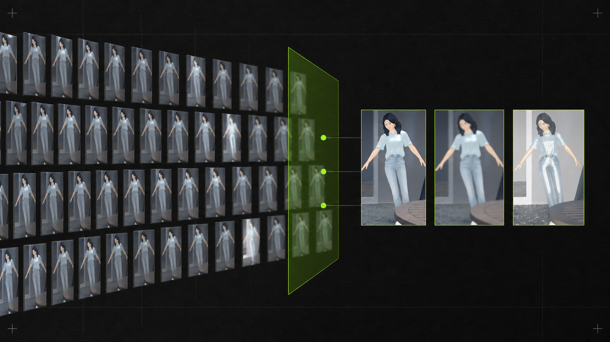
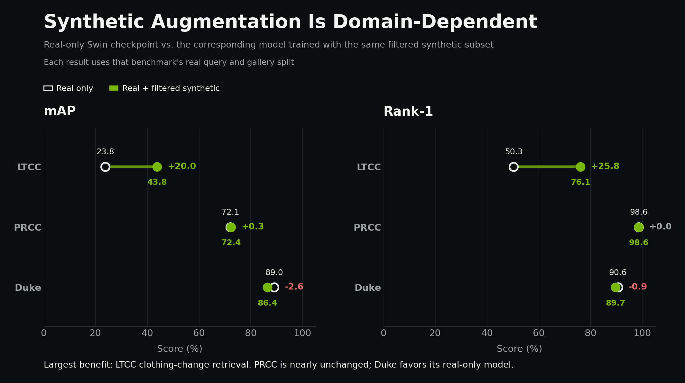

# ReID Training Process and Results

> Evidence-backed analysis for the NVIDIA blog draft  
> Repository metrics verified: 2026-07-26  
> Primary metric source:
> [`checkpoint_metrics.csv`](experiments/reid/repository_training_results/tables/checkpoint_metrics.csv)

## Executive Summary

The experiments investigated whether synthetic person crops could improve a
Swin Transformer ReID model, especially under clothing changes and other
appearance variations.

The main finding is not simply that synthetic data helped. Its effect depended
on how the data was selected and how closely it matched the target domain:

- On LTCC, adding 6,152 carefully filtered synthetic crops increased mAP from
  23.8% to 43.8% and Rank-1 accuracy from 50.3% to 76.1%.
- The filtered LTCC model slightly exceeded the older unfiltered model in mAP
  and Rank-1. That older run used a separate seven-identity dataset, so this
  score comparison is not a controlled data-volume ablation.
- On PRCC, the same filtered subset produced only a 0.3-point mAP increase and
  no Rank-1 change.
- On Duke, the filtered synthetic model remained 2.6 mAP points below the
  separately trained real-only model.
- In a controlled synthetic-only comparison, the 30,000-image model
  transferred better to Duke, LTCC, and PRCC than the 100,000-image model.
- A generalized model trained on three real domains and synthetic data traded
  peak dataset-specific accuracy for broader cross-domain coverage.

The scientifically defensible conclusion is:

> Synthetic data was most useful when it supplied variation that matched a
> weakness in the target domain. Increasing the number of repeated synthetic
> variants without adding identities or genuinely new observations did not
> consistently improve generalization.

## Blog-Ready Summary

The researchers converted JSON-annotated synthetic scenes into 233,840 person
crops organized in a Market-1501-compatible structure. An audit found that
many crops represented repeated render variants of the same person at the same
moment. The team therefore grouped samples by identity, camera, sequence,
frame, and source bounding box, then retained at most three variants from each
group. This reduced the synthetic pool to 6,152 crops while preserving all 39
synthetic identities.

The strongest effect appeared on LTCC, where clothing changes make visual
matching particularly difficult. A Swin-based model trained only on LTCC
reached 23.8% mAP and 50.3% Rank-1 accuracy. Adding the filtered synthetic
subset increased performance to 43.8% mAP and 76.1% Rank-1 accuracy. The
filtered model also slightly exceeded an older unfiltered synthetic model, but
the two synthetic sources differed and should not be treated as a controlled
volume comparison.

The same augmentation was not equally effective on every benchmark. PRCC
changed only marginally, while the strongest Duke result remained the
real-only model. Synthetic-only experiments reinforced this pattern: a
30,000-image subset transferred better to all three real datasets than a
100,000-image subset containing more variants of the same 39 identities.
Together, these results indicate that synthetic-data composition and domain
alignment mattered more than raw image count.

## Research Questions

The experiment sequence addressed four questions:

1. Can synthetic augmentation improve a real ReID model?
2. Does removing repeated synthetic variants improve data efficiency?
3. Does one synthetic subset help different ReID domains equally?
4. Can one mixed-domain model provide useful performance across several real
   benchmarks?

## Data Preparation

### Converting Synthetic Scenes

The source dataset contained rendered images and JSON annotations. The
conversion pipeline:

1. Read each non-metadata annotation file.
2. Extracted person bounding boxes from the corresponding rendered image.
3. Assigned person identity from `character_id`.
4. Preserved camera, sequence, frame, variant, and source-box information.
5. Wrote each crop using a Market-1501-compatible filename.
6. Recorded the complete source relationship in `manifest.csv`.

The conversion produced:

| Item | Count |
| --- | ---: |
| Processed source images | 67,749 |
| Person crops written | 233,840 |
| Synthetic identities | 39 |
| Cameras | 14 |
| Camera-sequence combinations | 112 |
| Person-at-moment groups | 2,054 |
| Invalid crops skipped | 2,100 |
| Conversion errors | 0 |

All generated crops were placed in `bounding_box_train`. Synthetic `query` and
`bounding_box_test` directories were intentionally left empty because the
synthetic dataset was designed as training augmentation, not as the source of
headline evaluation results.

### Detecting Repetition

The manifest showed that the apparent size of the synthetic dataset was driven
partly by repeated versions of the same underlying observation:

| Variants for one person-at-moment group | Groups |
| ---: | ---: |
| 1 | 5 |
| 47 | 1 |
| 50 | 734 |
| 149 | 12 |
| 150 | 1,302 |

The strict filtering key was:

```text
person ID + camera ID + sequence ID + frame ID + source box index
```

Within each group, the three lowest variant IDs were retained. This produced:

| Synthetic pool | Images | Identities | Retention |
| --- | ---: | ---: | ---: |
| Original converted pool | 233,840 | 39 | 100.00% |
| Three-variant filtered pool | 6,152 | 39 | 2.63% |
| Removed | 227,688 | 0 | 97.37% |



*The filter reduced repeated render variants while retaining every synthetic
identity.*

### Protecting Evaluation Integrity

The following rules were applied to the primary comparisons:

- Synthetic crops were used only in training.
- LTCC models were tested on the real LTCC query and gallery split.
- Duke models were tested on the real Duke query and gallery split.
- PRCC models were tested on the real PRCC query and gallery split.
- Synthetic person IDs were offset before merging so they could not collide
  with real identities.
- The generalized dataset used separate person and camera namespaces for
  Duke, LTCC, PRCC, and synthetic data.
- Official benchmark query and gallery folders were not merged into training.

### Final Dataset Mixes

| Training experiment | Real images | Synthetic images | Total images | Total IDs |
| --- | ---: | ---: | ---: | ---: |
| LTCC real only | 9,576 | 0 | 9,576 | 77 |
| LTCC + older unfiltered set | 9,576 | 3,486 | 13,062 | 84 |
| LTCC + filtered synthetic | 9,576 | 6,152 | 15,728 | 116 |
| Duke real only | 8,784 | 0 | 8,784 | 702 |
| Duke + filtered synthetic | 8,784 | 6,152 | 14,936 | 741 |
| PRCC real only | 22,898 | 0 | 22,898 | 150 |
| PRCC + filtered synthetic | 22,898 | 6,152 | 29,050 | 189 |
| Generalized mixed-domain | 37,338 | 116,920 | 154,258 | 875 |
| Synthetic only, 30k | 0 | 30,000 | 30,000 | 39 |
| Synthetic only, 100k | 0 | 100,000 | 100,000 | 39 |

The generalized experiment used a less restrictive synthetic selection than
the three-variant target-specific experiments. It retained exactly 50% of the
original crop pool, with up to 61 variants per person-at-moment group.

## Training Process

### Backbone Selection

Early experiments included ResNet-based ReID models. The main study then
standardized on `swin_base_patch4_window7_224`, initialized from the same
Market-1501/AICity pretrained Swin model where local controlled comparisons
were required.

Two early fine-tuning attempts established an important constraint:

- A ResNet checkpoint could not be resumed into a Swin model because the
  backbone state dictionaries were incompatible.
- A ResNet checkpoint with a 77-class classifier could not be resumed into a
  seven-class synthetic-only run because the classifier dimensions differed.

The final strategy therefore started new Swin runs from compatible pretrained
weights and created a classifier matching each merged training identity set.
Failed resume attempts are not included in the reported results.

### Core Training Configurations

| Experiment family | Input | Batch | Epochs | Checkpoints | Base LR |
| --- | ---: | ---: | ---: | ---: | ---: |
| LTCC real and filtered mix | 384 x 192 | 32 | 150 | Every 5 epochs | 0.00035 |
| Duke filtered mix | 256 x 128 | 32 | 200 | Every 10 epochs | 0.001 |
| PRCC real and filtered mix | 256 x 128 | 48 | 120 | Every 10 epochs | 0.0006 |
| Generalized mixed-domain | 256 x 128 | 48 | 120 | Every 10 epochs | 0.0006 |
| Synthetic-only 30k and 100k | 256 x 128 | 48 | 120 | Every 10 epochs | 0.0006 |

Common design choices included:

- NVIDIA TAO Toolkit 6.0.0 PyTorch container
- Swin Base backbone
- Softmax classification and triplet metric loss
- Label smoothing
- Identity-aware sampling
- SGD with momentum
- Horizontal flipping and random erasing
- Stable checkpoint files rather than mutable `latest` files
- Seed 1234

The exact augmentation, feature dimension, learning-rate schedule, and sampler
settings varied between the LTCC, Duke, and PRCC experiment families. Results
should therefore be interpreted as controlled within-dataset comparisons, not
as a claim that the datasets themselves have directly comparable difficulty.

### GPU Workflow

Training and validation were separated across two GPUs:

| GPU | Main role |
| --- | --- |
| NVIDIA GeForce RTX 3090, 24 GB | Primary Swin training and recovery evaluations |
| NVIDIA GeForce RTX 5070, 12 GB | Concurrent checkpoint evaluation |

While GPU 0 trained the generalized model, GPU 1 evaluated stable checkpoints
on the real target splits. The evaluation queues were resumable and skipped
completed checkpoint-target pairs.

For the large generalized sweep, CPU-side re-ranking and sampled match-grid
generation were disabled. Re-ranking had become the evaluation bottleneck and
the match grids produced substantial output without changing mAP or CMC
metrics.

## Evaluation Protocol

### Metrics

- **mAP:** evaluates the quality of the complete ranked retrieval list.
- **Rank-1:** percentage of queries whose first retrieved result is correct.
- **Rank-5 and Rank-10:** whether a correct match appears in the first five or
  ten results.

### Two Result Protocols

The repository contains two valid but different evaluation families:

1. **Target protocol:** Dataset-specific LTCC, Duke, and PRCC experiments use
   their configured TAO evaluation, including re-ranking where enabled.
2. **Raw protocol:** Generalized, synthetic-only, and external-pretrained
   cross-dataset sweeps disable re-ranking and sampled retrieval grids.

Metrics can be compared within one protocol and target split. Raw generalized
scores should not be numerically ranked against re-ranked target-specific
scores as if they came from an identical evaluation procedure.

Best checkpoints below are selected by mAP. They are not automatically the
last training checkpoint.

## Dataset-Specific Results

### LTCC: Strong Synthetic Benefit

| Training data | Best epoch | mAP | Rank-1 |
| --- | ---: | ---: | ---: |
| LTCC real only | 99 | 23.8% | 50.3% |
| LTCC + older unfiltered synthetic | 24 | 43.1% | 74.4% |
| LTCC + three-variant filtered synthetic | 44 | **43.8%** | **76.1%** |

The filtered model improved over the real-only Swin model by:

- **+20.0 percentage points mAP**
- **+25.8 percentage points Rank-1**

It also exceeded the older unfiltered result by 0.7 mAP points and 1.7 Rank-1
points.

This is the strongest evidence in the project that carefully selected
synthetic variation can address a target-domain weakness. LTCC explicitly
contains clothing-change conditions, which are more closely aligned with the
appearance variation emphasized by the synthetic data.

The comparison with the older unfiltered run should be described as supporting
evidence rather than a controlled ablation. That experiment used 3,486
synthetic images from seven identities, while the filtered run used 6,152
images from 39 identities and a later training configuration. The filtered run
was not smaller than this older training set. Its 2.63% retention figure is
relative to the later 233,840-crop converted pool.


### Duke: Real-Only Model Remained Stronger

| Training data | Best epoch | mAP | Rank-1 |
| --- | ---: | ---: | ---: |
| Duke real only, transferred final model | 199 | **89.0%** | **90.6%** |
| Duke + older synthetic mix | 109 | 85.9% | 89.3% |
| Duke + three-variant filtered synthetic | 99 | 86.4% | 89.7% |

The filtered model improved slightly over the older synthetic mix, but it
remained below the real-only Duke model:

- **-2.6 percentage points mAP**
- **-0.9 percentage points Rank-1**

This indicates that the same synthetic subset did not provide a useful
domain-specific advantage for Duke. The real-only Duke checkpoint was
transferred from another machine and evaluated on the local Duke query/gallery
split. Its result is valid as an evaluated reference, but it is not as tightly
controlled as the locally paired PRCC experiment.

### PRCC: Effectively Neutral

| Training data | Best epoch | mAP | Rank-1 |
| --- | ---: | ---: | ---: |
| PRCC real only | 99 | 72.1% | 98.6% |
| PRCC + three-variant filtered synthetic | 99 | **72.4%** | 98.6% |

The filtered subset changed PRCC by:

- **+0.3 percentage points mAP**
- **0.0 percentage points Rank-1**

Both runs started independently from the same pretrained Swin model and used
the same hyperparameters. Without repeated seeds or uncertainty estimates, a
0.3-point change should be described as marginal rather than a strong gain.

### Cross-Dataset Synthetic Effect

| Dataset | Real-only mAP | Filtered-mix mAP | Change |
| --- | ---: | ---: | ---: |
| LTCC | 23.8% | 43.8% | **+20.0** |
| Duke | **89.0%** | 86.4% | **-2.6** |
| PRCC | 72.1% | 72.4% | **+0.3** |



The direction and size of the effect changed by dataset. This rules out the
claim that synthetic augmentation was universally beneficial.

## Synthetic-Only Transfer

The 30k and 100k experiments used no real training images. They shared the
same Swin backbone and hyperparameters and were evaluated using the same raw
protocol.

| Real target | Synthetic-only 30k mAP | Synthetic-only 100k mAP | 30k advantage |
| --- | ---: | ---: | ---: |
| Duke | **29.7%** | 25.7% | +4.0 |
| LTCC | **16.2%** | 12.3% | +3.9 |
| PRCC | **37.7%** | 30.3% | +7.4 |

Rank-1 followed the same pattern:

| Real target | Synthetic-only 30k Rank-1 | Synthetic-only 100k Rank-1 | 30k advantage |
| --- | ---: | ---: | ---: |
| Duke | **40.9%** | 36.8% | +4.1 |
| LTCC | **45.2%** | 38.1% | +7.1 |
| PRCC | **47.9%** | 39.4% | +8.5 |

The 30k subset retained approximately 14 variants per person-at-moment group,
while the 100k subset retained approximately 48. Both contained the same 39
identities. The larger set therefore increased repeated variants much more
than identity diversity.

The best 30k checkpoint occurred at epoch 9 for all three real targets.
Performance then declined by the final epoch, which is consistent with
increasing specialization to the synthetic domain.


## Percentage Sweep

An earlier LTCC sweep sampled a fixed percentage from every synthetic identity.
Unlike the three-variant filter, it did not group samples by person and moment,
so repeated variants remained.

| Synthetic selection | Synthetic images | Best observed mAP | Best epoch | Completion note |
| --- | ---: | ---: | ---: | --- |
| Three-variant filter | 6,152 | **43.8%** | 44 | Completed |
| 10% per identity | 23,385 | 40.7% | 29 | Completed |
| 25% per identity | 58,470 | 34.9% | 9 | Interrupted early |
| 50% per identity | 116,924 | 27.1% | 14 | Did not complete 150 epochs |

This sweep is useful diagnostically but is not a clean dose-response
experiment because the runs stopped at different points and some suffered CUDA
failures. The controlled 30k-versus-100k synthetic-only comparison provides
stronger evidence for the effect of repeated volume.

## Generalized Multi-Domain Model

The generalized Swin model combined:

- Identity-disjoint real training data from Duke, LTCC, and PRCC
- 116,920 synthetic crops, exactly 50% of the original synthetic pool
- 875 total training identities
- 93 held-out real validation identities
- Separate official query/gallery evaluation for each real benchmark
- A namespaced combined stress split

The final epoch-119 checkpoint produced:

| Raw evaluation target | mAP | Rank-1 | Rank-5 | Rank-10 |
| --- | ---: | ---: | ---: | ---: |
| Duke | 55.4% | 71.2% | 84.2% | 88.6% |
| LTCC | 29.5% | 64.7% | 75.9% | 80.5% |
| PRCC | 71.5% | 98.6% | 100.0% | 100.0% |
| Combined stress split | 46.2% | 70.2% | 81.8% | 86.1% |

The three-dataset macro mAP was 52.1%. Performance improved from epoch 9 to
epoch 119 on all four raw evaluation targets:

| Target | Epoch 9 mAP | Epoch 119 mAP | Change |
| --- | ---: | ---: | ---: |
| Duke | 37.7% | 55.4% | +17.7 |
| LTCC | 20.2% | 29.5% | +9.3 |
| PRCC | 62.5% | 71.5% | +9.0 |
| Combined stress | 31.8% | 46.2% | +14.4 |


The generalized model substantially outperformed synthetic-only and external
pretrained baselines under the same raw protocol. However, this experiment
does not isolate the contribution of synthetic data because a real-only
generalized control model was not trained. It should be presented as a
generalization study, not as an additional synthetic-impact ablation.

## Checkpoint Selection Matters

Several experiments peaked before their final epoch:

| Experiment | Best epoch | Best mAP | Final epoch | Final mAP | Final minus best |
| --- | ---: | ---: | ---: | ---: | ---: |
| LTCC real only | 99 | 23.8% | 149 | 21.7% | -2.1 |
| LTCC + filtered synthetic | 44 | 43.8% | 149 | 41.4% | -2.4 |
| LTCC + 10% synthetic | 29 | 40.7% | 149 | 33.1% | -7.6 |
| Duke + filtered synthetic | 99 | 86.4% | 199 | 84.7% | -1.7 |
| PRCC real only | 99 | 72.1% | 119 | 71.8% | -0.3 |
| PRCC + filtered synthetic | 99 | 72.4% | 119 | 72.4% | 0.0 |

This supports three practical decisions:

1. Save checkpoints throughout training.
2. Select models using held-out retrieval metrics rather than terminal loss.
3. Use early stopping or shorter schedules when synthetic-domain overfitting
   appears.

## What the Results Support

### Strongly Supported

- Strictly filtered synthetic data substantially improved LTCC.
- The 6,152-image filtered subset retained all synthetic identities while
  removing 97.37% of the original crop volume.
- Synthetic augmentation had different effects on LTCC, Duke, and PRCC.
- The synthetic-only 30k model transferred better than the 100k model on all
  three real targets under a shared raw protocol.
- Best-checkpoint selection was important because several final checkpoints
  regressed.

### Supported With Caveats

- The filtered LTCC model slightly exceeded the older unfiltered LTCC model.
  The evaluation split is comparable, but the older run used fewer images,
  fewer synthetic identities, and a different training construction.
- The filtered Duke model underperformed the transferred real-only Duke
  checkpoint. The local evaluation is valid, but the baseline was trained on
  another machine.
- The generalized model demonstrated cross-domain utility, but no real-only
  generalized control exists to quantify the synthetic contribution.

### Not Supported by the Current Experiments

- Synthetic data always improves ReID.
- More synthetic images necessarily improve transfer.
- The 97.37% reduction produced a 97.37% reduction in training time. Runtime
  was not measured as a controlled experiment.
- Raw and re-ranked scores can be mixed into one ranking.
- The reported differences are statistically significant. Most controlled
  runs used one seed and were not repeated.
- TensorRT optimization improved accuracy. TensorRT belongs to deployment
  optimization; the accuracy experiments evaluate trained checkpoints.

## Recommended Blog Conclusions

Use the following claims in the article:

1. **Data composition mattered more than raw crop count.**
2. **The largest gain occurred on the clothing-change LTCC benchmark.**
3. **Synthetic augmentation was domain-dependent rather than universally
   beneficial.**
4. **Repeated variants could reduce transfer quality even when they increased
   dataset size.**
5. **A generalized checkpoint broadened domain coverage but did not replace
   the strongest dataset-specific models.**

Avoid describing the filtered method as a universal solution. The more precise
message is that manifest-aware filtering made the synthetic pool more useful
for the domain whose missing variation it matched.

## Suggested Results Passage

The strongest improvement appeared on LTCC, where the real-only Swin model
reached 23.8% mAP and 50.3% Rank-1 accuracy. Adding 6,152 filtered synthetic
crops increased performance to 43.8% mAP and 76.1% Rank-1 accuracy. This
corresponds to gains of 20.0 and 25.8 percentage points, respectively.

The filtered pool represented only 2.63% of the later 233,840-crop synthetic
collection and produced the strongest observed LTCC mAP. It also slightly
exceeded an older unfiltered LTCC experiment, although that run used a separate
3,486-image, seven-identity source and is not evidence that the filtered run
used fewer training images.

The effect was domain-dependent. PRCC changed only marginally, and the
real-only Duke model remained stronger than its synthetic-augmented
counterpart. A separate synthetic-only experiment produced the same overall
lesson: the 30,000-image model transferred better than the 100,000-image model
on Duke, LTCC, and PRCC. The additional 70,000 images increased variants of the
same 39 identities rather than adding new identities. This controlled
30k-versus-100k comparison is the clearest evidence that additional synthetic
volume did not guarantee better real-domain transfer.

## Suggested Figure Captions

**Synthetic filtering figure.** Synthetic crops were grouped by identity,
camera, sequence, source frame, and bounding box. Retaining at most three
variants per person-at-moment group reduced the pool from 233,840 to 6,152
crops while preserving all 39 synthetic identities.

**LTCC results figure.** Adding the filtered synthetic subset improved LTCC
mAP from 23.8% to 43.8% and Rank-1 accuracy from 50.3% to 76.1%, while using
only 2.63% of the original synthetic crop volume.

**Cross-dataset figure.** The same filtered synthetic subset produced a large
gain on LTCC, a marginal change on PRCC, and a reduction relative to the
strongest real-only Duke model, demonstrating that synthetic augmentation was
domain-dependent.

**Generalized-model figure.** One Swin checkpoint trained on namespaced Duke,
LTCC, PRCC, and synthetic identities was evaluated separately on each real
benchmark and on an additional combined stress split.

## Evidence and Source Map

- [Repository-wide training report](experiments/reid/repository_training_results/TRAINING_RESULTS_REPORT.md)
- [Checkpoint metric table](experiments/reid/repository_training_results/tables/checkpoint_metrics.csv)
- [Synthetic conversion rules](datasets/final_syntetic_market1501/README.md)
- [Older LTCC synthetic-data audit](experiments/reid/ltcc+syntetic/data_audit.md)
- [LTCC filtered-data audit](experiments/reid/ltcc_syntetic_filtered_seq/DATA_AUDIT.md)
- [Duke filtered-data audit](experiments/reid/duke_syntetic_filtered_seq/DATA_AUDIT.md)
- [PRCC controlled-comparison audit](experiments/reid/prcc_syntetic_filtered_seq/DATA_AUDIT.md)
- [Generalized model data audit](experiments/reid/generalized_reid_swin/DATA_AUDIT.md)
- [Synthetic-only 30k audit](experiments/reid/syntetic_only_filtered_30k/DATA_AUDIT.md)
- [Synthetic-only 100k audit](experiments/reid/syntetic_only_filtered_100k/DATA_AUDIT.md)
- [Current NVIDIA blog draft](nvidia_blog.md)

## Editorial Notes

- Replace all university, researcher, grant-hardware, quotation, and URL
  placeholders in `nvidia_blog.md` before publication.
- State whether a score uses the target or raw protocol when a table includes
  generalized or synthetic-only models.
- Refer to the synthetic dataset as training augmentation unless discussing
  the explicitly labeled synthetic-only transfer experiment.
- Keep TensorRT deployment claims separate from checkpoint-accuracy claims
  unless latency and throughput measurements are added.
- Do not state that the 6,152-image filtered run was smaller than the older
  unfiltered LTCC run. The older run used 3,486 images from a different,
  seven-identity synthetic source.
